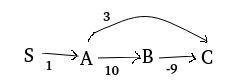

# Homework Assignment 10
### Algorithms 1 Summer 2019
### ID: 011862141
#### Aug 17th, 2019
---

## Question 1 - Odd number of blue edges
We will term this problem SSSP-ONBE (for _odd number of blue edges_)
#### Preliminary Observations
1. This (without the ONBE restriction) is the generic version of SSSP, which is most efficiently solved with the Bellman Ford algorithm.
1. A subpath of a path with an odd number of blue edges does not necessarily have the ONBE property. Therefore, we must also maintain shortest paths that have even number of blue edge, which we can use as subpaths.
1. This Motivates us to maintain two _d_-values for each node $d_{odd}$ and $d_{even}$

#### Main Observation
Let $P=(s=v_0,v_1,v_2,\ldots,v_{k-1},u=v_k)$ be a shortest path from _s_ to _u_. and let _P_ have an odd number of blue edges.  Then if $(v_{k-1},u)$ is a blue edge then $(s,v_1,\ldots,v_{k-1})$ is a shortest path from $s$ to $v_{k-1}$ which has an **even** number of blue edges. Similarly, if $(v_{k-1},u)$ is a red edge then $(s,v_1,\ldots,v_{k-1})$ is a shortest path from $s$ to $v_{k-1}$ which has an **odd** number of blue edges.

#### Pseudocode
    INITIALIZE-SINGLE-SOURCE-ONBE(G=(V,E),s):
        for each vertex v in V:
            d.odd[v] = infinity
            d.even[v] = infinity
            pi.odd[v] = infinity
            pi.even[v] = infinity

    RELAX-ONBE((u,v),w,C):
        if C((u,v))="blue":
            if d.odd[v] > d.even[u]+w(u,v):
                d.odd[v] = d.even[u]+w(u,v)
                pi.odd[v] = u
            if d.even[v] > d.odd[u]+w(u,v):
                d.even[v] = d.odd[u]+w(u,v)
                pi.even[v] = u
                
        else: # color is red
            if d.odd[v] > d.odd[u]+w(u,v):
                d.odd[v] = d.odd[u]+w(u,v)
                pi.odd[v] = u
            if d.even[v] > d.even[u]+w(u,v):
                d.even[v] = d.even[u]+w(u,v)
                pi.even[v] = u

    SSSP-ONBE(G=(V,E),w,s,C):
        INITIALIZE-SINGLE-SOURCE-ONBE(G=(V,E),s)
        for i=1 to |V|-1:
            for (u,v) in E:
                RELAX-ONBE((u,v),w,C)

#### Correctness
**Claim A**: If the shortest path from _s_ to _u_ has a last edge which is blue, the algorithm will find it.
**Proof**: by induction, the base case is a path of a single blue edge. The induction is on the length of the path, and follows from the Main Observation and from the lemmas presented in class.
**Claim B**: If the shortest path from _s_ to _u_ has a last edge which is red, the algorithm will find it.
**Proof**: by induction, the base case is a _u_=_s_. The induction is on the length of the path, and follows from the Observation and from the lemmas presented in class.

#### Extracting weight and path from solution
Once our _SSSP-ONBE_ algorithm ran, we read the results (for a node _v_) as follows:
1. The ONBE distance from _s_ to _v_ is the value in `d.odd[v]`
1. The predecessor in the path is `pi.odd[v]`, let's call it _u_.
1. If the edge (u,v) is blue, we continue tracing the path by looking at `pi.even[u]`. If (u,v) is red, we use `pi.odd[u]`. This logic continues until we reach _s_.

#### Runtime
The runtime is on par with Bellman-Ford's, since we added $O(1)$ operations in each step. So it remains $O(|V||E|)$.

## Question two - prove optimum relaxing order on |V|-1 nodes exists

#### Proof
We assume every node is reachable from _s_.

1. Recall that the solution to the SSSP problem is actually a tree, where _s_ is in the root and the shortest path to each node is the walk from the root to the node. 
1. A tree is by definition a DAG, and it has exactly $|V|-1$ edges (since we start with the root, i.e. 1 node and 0 edges, and construct the tree by adding an edge and a node at each step until we added all the |V| nodes in the graph).
1. We showed in class that if the graph is a DAG, finding the shortest path can be done by relaxing the edges in topological order, going over each edge once. 
1. We further observe, that if we remove all the edges that are not part of the shortest-path tree from the graph, the distance from _s_ to each node doesn't change (since the shortest distance path still exists in the reduced graph), and it is still $\delta(s,v)$.
1. So, if we construct a graph $G'=(V,E')$ where $E' \subseteq E$ is the set of $|V|-1$ edges that participate in the shortest path tree, and relax this graph in topological order from _s_:
    1. This will solve the SSSP problem in $G'$
    1. The solution we reach will have the same $d[v]= \delta(s,v)$ for every node $v$ in the graph, as if we solved SSSP in $G$.

*Q.E.D.*

## Question 3 - prove or disprove
### One negative-weight edge in the graph
Dijkstra will NOT compute the correct distance.
Consider the graph

The true shortest distance from A to C is 1. However the algorithm execution will proceed as follows:
1. After INITIALIZE-SINGLE-SOURCE, _S_ has a distance of 0, the other nodes have inifinity. So _S_  is extracted first.
1. _A_ is the only node adjacent to _S_, so it will be the only node except _S_ to have a finite distance. it will be extracted next.
1. After the algorithm finishes handling _A_: _B_ and _C_ are in the queue with weights 10 and 3 respectively. _C_ will be handled next.
1. _C_ has no outgoing edges, so it will be handled without updating any weights.
1. _B_ will be handled last.

So edge BC will not be handled at all and the distance to _C_ will be incorrect.

### Negative edges only from S, no negative circles
Dijkstra will compute the CORRECT distances.
Proof:
Let's denote S's neighbors M: $M=\{v | (s,v)\in E\}$

**Claim 1**: Every shortest path from _s_ to a node $v \in V \setminus \{s\}$ will not have a negative-weight (abbreviated N.W.) edge, except possibly as the first edge in the path. 
**Proof**: for a path to use a negative weight edge, not as a first edge, the path has to go back to _s_ (since the only N.W.-edges are from _s_). We showed in class that shortest paths in graphs that do not have negative circles, do not contain circles, so paths cannot go back to _s_ and therefore will not have N.W. edges except possibly the first.

**Claim 2**: The invariant still holds. 
**Proof**: The edges between $y$ and $u$ are have all non-negative weights as long as $y$ is not the first node in the path i.e. $y \ne s$, the edges betwen $y$ and $u$ will be positive.
$y \ne s$ since $y \in V \setminus S$ while  $s$ is added to $S$ before any other node is added.

### Equivalence between Dijkstra's and Prim running from s
The statement is FALSE. The minimum spanning tree is different than a tree of minimum-distance paths from a particular source node. 
consider the following graph:

The distance from S to D is 3 directly, or $4+6\epsilon$ through ABCD. Since Prim is "interested" in adding the lightest-weight edge among the edges crossing the cut, it will contract on SA, AB, BC, CD. these edges are all lighter than SD. However, in Dijkstra's algorithm, the edge SD will be used since it is on the shortest path from S to D.

## Question 4
### Counting distinct paths

#### Recursive formula
$paths(s,t) = \begin{cases}
1 & s=t\\
\sum \limits_{u: (u,t) \in E} paths(s,u) & else
\end{cases}$

Explanation: the base case is that a node has a single path to itself. The recursion is based on the fact that if there are _k_ ways to get from _s_ to a node _A_, and _A_ has an edge to _t_, then there are _k_ ways to get from _s_ to _t_ through _A_. Other nodes which have edges to _t_ will add to the path count total.

#### Dynamic programming algorithm
Explanation: our goal is to determine the number of paths from _s_ to each node _A_ in the graph. Once we accounted for all the paths going _into_ _A_, we can use this information to update the total number of paths of all the nodes which _A_ touches.
The topological sorting order is useful in this respect since it guarantees that when we reach a node _A_, we already treated the nodes that have edges going into _A_.
Note that topological order guarantees _s_ will be first (since if it were not first, the first node by definition of the problem have edges going into it from some other node(s), therefore those edges would point left, or "backwards") and that _t_ will be last (since if it were not last, some edges going out of the last node would point backwards).

1. initialize p[v] as follows: $\forall v \in V:\ p[v]=\begin{cases} 1 & v=s\\ 0 & else \end{cases}$
1. For each $v \in V$ by toplogical order:
1. &emsp;for each _u_ such that $(v,u) \in E$:
1. &emsp;&emsp;p[u] = p[u]+p[v]
1. return p[t]

### Counting distinct shortest paths
The solution here is an extension of Dijkstra. In Dijkstra, we maintain for every node _u_ d[u], the shortest distance to that node. It might happen in the RELAX subroutine that the comparison shows a new path with the same distance, in normal Dijkstra we ignore this case since we only need one possible shortest path. Here's a modified version of RELAX to be plugged into Dijksta to keep track of the number of different paths:

RELAX-CDSP((u,v),w):
1. if d[v] > d[u] + w(u,v):
1. &emsp; d[v] = d[u] + w(u,v)
1. &emsp; p[v] = p[u]
1. &emsp; &pi;[v] = u
1. else if d[v] = d[u] + w(u,v):
1. &emsp; p[v] = p[v] + p[u]

The initialization of p is as in the previous problem, $\forall v \in V:\ p[v]=\begin{cases} 1 & v=s\\ 0 & else \end{cases}$

Explanation:
- When we find a new path to _v_ that is shorter than all previously discovered path, and the last node along the path is _u_, the number of shortest paths to _v_ is the same as the number of shortest paths to _u_. This is becuase all previously discovered "shortest path" were not actually shortest paths. All shortest paths to _u_, with the addition of edge (u,v), are shortest paths to _v_. 
- When we find a new path to _v_, with _u_ the last node along the path, that is _equal_ in weight to an existing (shortest) path, that means that all previously found shortest paths are still valid, plus all the shortest paths from _s_ to _u_ are _additional_ shortest paths from _s_ to _v_ when edge (u,v) is added.

