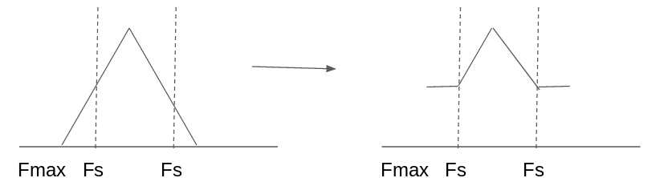
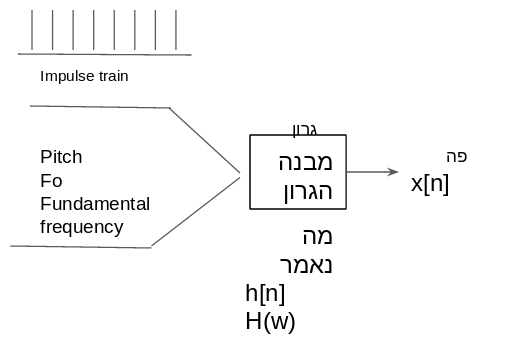

https://www.cs.biu.ac.il/~jkeshet

# זיהוי דיבור

2019-03-06

יוסי עדי
יוסי ק יעביר את ההרצאות הראשונות השאר יוסי ע

עיבוד אותות

אלגוריתמים קלאסיים זיהוי דיבור

קשה? מצריך עבודה 

ארבעה תרגילי תכנות

היום: intro

דאטה של ספיצ' 1000 שעות מינימום לאימון (עולה עם הזמן)
גוגל, אמאזון - 50-60 *אלף* שעות.

מחשב שמנהל דיון debate.
אתגר שIBM המציאו.

רוב המחקר הוא על אנגלית. אין משהו מיוחד לשפה. יש גם על מנדרינית. נשמע כמו דיבור גם אם ההברות לא מרכיבות מילים.

התשמשו באותו מודל כדי להפריד דיבור לרעש רקע. ממש נשארות שתי קומפוננטות נפרדות של רעש הרקע והדיבור.

התחילו מהרבה אנליזה סטטיסטית, צמצום למספר מאוד קטן של מילים (כן/לא) וכד'.
expert systems. perception.

להגדיר לפי תדרים איזה הברה אמרתי.

היום: להתעלם מידע קודם ולהסתמך על הרבה דאטה.

בשנות ה70 80 התפתחו האלגוריתמים המודרנים אבל חיכו עוד עד שהחומרה תאפשר שימוש בהם.

### למה זו בעיה קשה?
תמונה: גודל קבוע (resize אם צריך) 
בדיבור: גם הקלט וגם הפלט מורכבים. אין גודל קבוע. אפילו אם אני אומר את אותה מילה זה בכלל לא נראה דומה.

במילישניה אין אינפורמציה (בניגוד לוידאו שכל פריים מכיל הרבה אינפורמציה)

הרבה data שמתאמנים עליו 
זה אנשים שקראו ספר. 
אבל ביום יום מדברים אחרת.
כדי לאמן מודל לאימון הספרות שאני מקריא בשיחה עם הבנק אולי הקראת ספר בכלל לא עוזרת.

אין כמעט דאטה סט spontaneous/ continuous. כמו שאנשים מדברים עם "אה..." וכיו"ב

המקרופון גם חשוב, האקוסטיקה משתנה ומצריכה כיול מחדש. אפילו עם אותו טלפון אם אני מפנה את הראש הצידה זה כבר נשמע אחרת והמערכת לא מצליחה להבין.

אתר WER ARE WE מראה את הבנצ'מרקים בתחום. ירידה מ40% לפני 22 שנה ל? היום.

הALEXA של מיקרוסופט עם 3 מקרופונים.

### איך נראה סיגנל דיבור
הזמן בציר X, ובציר Y אמפליטודה. 
אני צריך לדגום אותו.
דיבור דוגמים 16000 הרץ. דיבור 44100.

$A \in \mathbb{R}^{16000}$

[הסבר על למה מרחק אוקלידי לא עובד וצריך ייצוג יותר סמנטי של הסיגנל]

עושים FFT ואז DYNAMIC TIME WARPING

תוכנה שנקראת PRAAT.
 מראה FFT על כל מקטע זמן קצר.
 

Overtone - התופעה של ריבוי תדרים שיוצאים מחלל תהודה אמיתי (גוף האדם)

יש אלגוריתמים לזיהו התדר הבסיסי

### Data driven vs. knowledge driven
שביל הזהב בין ללמוד ממומחים ללהתעלם ממומחים. למשל פונמות זה חשוב. יש משפחות של עיצורים.
* voicing - עם ויברציה של מיתרי הקול
* fricative - ש,ס
* בגד כפת - פוצצים

פונמות פחות תלויות שפה. יש באנגלית 40-50.

[הזכיר את התעתיק הפונטי המופיע במילון]

[הציג גרף רגישות לתדרים של אוזן אנושית]

זרק מושג mel frequency/ mel scale.
היה הקונבנציה, DL מצליח ללמוד בלי הנרמול הזה.
בפועל הראו שלומד משהו דומה (אבל לפעמים יותר מוצלח)

משבוע הבא יותר מתמטי פוריה וDL כמה שעורים

---
2019-03-13

נתחיל מעיבוד אותות

סיגנל אנלוגי $X_a(t)z$ . גלי הקול מרטיטים מגנט שנע בתוך סליל ומייצר וריאציות במתח.

רמקול זה אותו דבר רק בכיוון הפוך. צריך מגבר כדי להניע את הרמקול מספיק חזק.

סיגנל אנלוגי לא מתאים למחשב, צריך להמיר אותו לסידרה. $x[n]z$. דיסקרטיזציה.

**דיסקרטיזציה**

$x[n] = x_a(nT)$ continuous to discrete: C/D

איך נקבע הT? 
בעזרת **Nyquist-Shannon Theorem**:
אם נדגום בקצב מהיר שהוא פי שניים מהתדר הכי גבוה $f_{max}z$ 
נוכל לשחזר את הסיגנל בצורה מושלמת

ההנחה בהשמה $X[n]z = X_a(nT)z$ היא שהדיוק של ייצוג האמפליטודה הוא אינסופי.
במקום C/D שהוא קונספטואלי
משתמשים ב A/D. נותן דיוק סופי. 
לזה אין משפט נייקוויסט.

#### 1. delta function

$$\delta[n] = \left\{ 1,\ n=0; 0,\ n \ne 0 \right\}$$

#### 2. step function

$$u[n] = \left\{ 1,\ n \ge 0; 0,\ n \lt 0 \right\}$$

##### 2.1 relation of $u$ and $\delta$
$u[n] = \sum\limits^{\infty}_{k=0}\delta[n-k]$
$\delta[n] = u[n] - u[n-1]$
#### 3. exponential function
$$x[n] = A\alpha^n,\ A,\alpha \in \mathbb{R}$$

#### 4. Sinusoidal function

$$x[n] = Acos(\omega\cdot n + \phi)$$

#### 5. Complex exponential function

$$A=a+ib = |A|e^{i\phi}$$
$$|A| = \sqrt{a^2+b^2},\ \phi = \tan^{-1}\frac{b}{a}$$
$$X[n] = Ae^{i\omega n} = |A|e^{i\phi}\cdot e^{i\omega n} = |A|e^{i(a\omega n + \phi)}$$

סיגנל מחזורי בטבע אינו בהכרח מחזורי במחשב. התנאי שהדגימה תחזור על עצמה בדיוק, הוא שהתדר הוא כפולה שלמה של תדר הדגימה.

#### מערכות ומערכות LTI

$y[n] = H(x[n])$

Linear: $H(\alpha_1 x_1[n]+ \alpha_2x_2[n]) = \alpha_1H(x_1[n]) + \alpha_2H(x_2[n])$
Time invariant: $y[n-n_0] = H(x[n-n_0])$

$h[n] \equiv H(\delta[n])$

מכאן הדימיון (הכמעט מוחלט) בין "סיגנל" למערכת LTI

$$y[n] = \sum\limits_{k=-\infty}^{\infty} h[n-k]\cdot x[k] \equiv h[n]*x[n]$$
where $*$ signifies _convolution_. הפעלה" של מערכת".

#### תנאי יציבות
$\sum\limits_{n=-\infty}^{\infty} |h[n]| \lt \infty$

##### דוגמא
$h[n] = A\alpha^n\cdot u[n]$

$\sum h[n] = \sum A\alpha^n u[n] = \sum A\alpha^n = \frac{A}{1-|\alpha|} \lt \infty$

### אנליזת פוריה לסדרות בדידות
DTFT:
$X(\omega) = \sum x[n] e^{-i\omega n}$

$X(\omega)$:
* Complex
* periodic with period $2\pi$
* $x[n] \in \mathbb{R} \Rightarrow X(\omega) = X(-\omega)$ (Symmetric) 

Inverse transform:
$x[n] = \frac{1}{2\pi} = \int\limits_{-\pi}^{\pi}X(\omega)e^{i\omega n}$

#### דוגמאות לשימוש בFourier

1. $x[n] = \delta[n-n_0] \Rightarrow X(\omega) = \sum \delta[n-n_0]e^{-i\omega n}  = 1\cdot e^{-i\omega n_0}$

1. $x[n] = a^nu[n] = a^n,\ n\ge0 \Rightarrow X(\omega) = \sum a^n e^{-i\omega n} = \sum (a e^{-i\omega})^n = \frac{1}{1-ae^{-i\omega}}$

----

March 27 2019 YK

אחד הבסיסים הלינאריים האפשרים הוא ייצוג של סינוסים. DTFT.
בייצוג הזה יש הרבה יותר הדירות בין דגימות של אותה מילה.

$$x[n]=\frac{1}{2\pi}\int\limits_{-\pi}^{\pi}X(\omega)e^{i\omega n} d\omega$$

$$X(\omega)=\sum\limits_{n=-\infty}^{\infty}x[n]e^{-i\omega n}$$

$e^{i\omega n} = \cos(\omega n) + i \sin(\omega n)$

w תדר.נמדד ביחידות $rad/sec = 2\pi/sec$ 

$\omega = 2 \pi f \rightarrow f $ frequenency measured in $1/sec = Hz$

אפשר ייצג את x[n]
ע"י אינסוף סינוסים, כ"א בתדר w
אחר.

x[n]: time domain
x(w): frequency domain

#### X(w)z קומפלקסי
מה עושים עם הקומפלקסי? רוב האינפורמציה נמצאת במגניטודה, אבל כדי לשחזר צריך את הפאזה. כדי לנתח לוקחים את  $|X(\omega)z|$.

#### עבור x[n]z ממשי: X(w)=x(-w)z

#### X(w)z מחזורי עם מחזוריות 2&pi;

מה שזה אומר שכל הסיגנל נמצא בין 0 ל &pi; (אפשר לשחזר את הסיגנל מהערכים בטווח הזה)

מה זה פאזה? זה הדיליי של כל סינוס. כל אחד חוזר בפאזה שונה. בהידהוד בחדר יש חשיבות לפאזות כי ההד מעוות את הפאזה של הדיבור המקורי.

$x[n] = A\cos(\omega_0n + \phi) \Rightarrow$

$X(\omega) = \sum\limits_{n=-\infty}^{\infty} A\cos (\omega_0n+\phi)e^{-i\omega n} \\
= \frac{A}{2}\sum_n[e^{i(\omega n + \phi)} + e^{-i(\omega n + \phi)}]e^{-\omega n i}\\
\ \\
= \frac{A}{2} e^{-i\phi} [\delta(\omega-\omega_0) + \delta(\omega+\omega_0)]\ [-\pi,\pi]$

כל vowel
מורכב משני תדרים עיקריים. יש מפות. בצרפתית יש 24 סוגים שונים של vowels.

#### מערכת הדיבור
vocal cords - the note. the frequency.
vocal tract - the cavities of the mouth and noise - _what_ we say

מיתרי הקול מייצרים איזשהו סיגנל בסיסי. לא, לא סינוס, אלא סידרה אינסופית של פולסים במרחק P ביניהם.
Pulse train.
הגוף מתאמץ לסגור, בגלל הזרימה של האוויר מהריאות הם נפתחים בפולס ונסגרים מיד בחזרה (גם בגלל ברנולי).
אמרנו שבמישור התדר הסיגנל רציף. 

---

3 April 2019 YK
####חזרה

sampling
$x[n]=X_a(nT)$

Fourier
$x[n]=\frac{1}{2\pi}\int\limits_\pi^\pi X(\omega)e^{i\omega n} dw$ DTFT

$X(\omega) = \sum\limits_{n=-\infty}^\infty x[n]e^{-i\omega n}$

impulse train with spacing P &harr; impulse trainn with spacing $\frac{2\pi}{p}$

הבעיה עם דגימה היא כאשר תדר טהור שקיים בסיגנל המקורי עלול ליפול בין שני תדרים בדגימה. התוצאה היא קונבולוציה עם פונקציית סינק, כלומר מריחה של התדרים סביב התדר האמיתי. כשיש שני תדרים מקוריים קרובים, לא נוכל להפריד אותם.

### משפט הדגימה
אם $X_a(t)z$ 
דגום כל T 
שניות 
$F_s=1/T$
וגם התדר הגבוה ביותר של 
$X_a(t)z$ 
הוא 
$F_{max}$
אז אפשר לדגום את 
$X_a(t)z$ 
בתדר גבוה מ 
$2F_{max}$
ולשחזר את 
$X_a(t)z$
בצורה מושלמת

מה קורה אם התדר הגבוה ביותר גדול מתדר הדגימה?

#### מודל הפקה של דיבור

#### שיערוך מעטפת הספקטרום
התחילו מדחיסה. האם אפשר לבטא את האבר ה n כסכום של אברים שלפניו כפול מקדמים. 
נעשה אופטימיזציה כלומר נמצא שגיאה ריבועית מינימלית של המקדמים.

$s[n] \approx \sum\limits_{i=1}^p a_is[n-i]\\
e[n]=s[n] - \sum\limits_{i=1}^p a_is[n-i]\\
\min\sum e^2[n] = \sum\left(s[n]-\sum a_is[n-1\right)^2\\
\frac{\partial \sum_n e^2[n]}{\partial a_k}=0\\
sum_{n=0}^m s(s[n]-sum_i a_i s[n-i](-s[n-k])=0$

$$\sum_n s[n]s[n-k]=\sum \sum$$

$$\phi(m,i)=\sum_{n=0}^m s[n] s[n-i]$$ autocorrelation

הדרך למצוא את התדר היסודי של הדיבור זה להסתכל על אוטוקורלציה. הפסגה המשמעותית הראשונה היא במרחק של זמן מחזור של התדר היסודי.

"Linear predictive coding"

