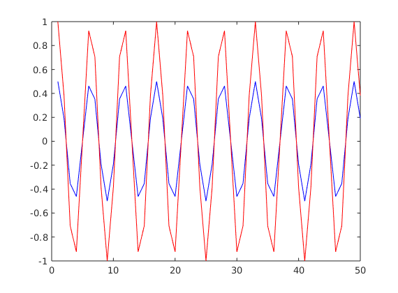
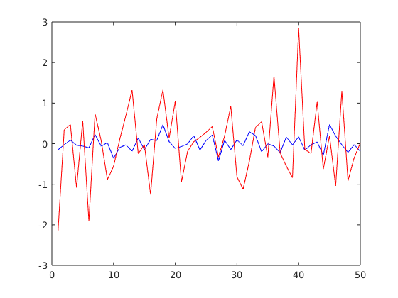

# MATLAB Exercise 2

## Illustration of analysis - synthesis 
Based On 2007 Moed A Q. 3

## 1. FBS Analysis/Synthesis 
### Analysis Cell code
```matlab
%% STFT of a single-frequency signal

% Analysis filter half-size 
Lh = 1024;
% the index _n_ for creating the analysis window
nh=(-Lh:Lh-1)';

% DFT length
M=64;

% ANALYSIS FILTER
% if we wanted to calculate the sinc from the sine function:
%%% w_analysis = sin(pi*nh/M)./(pi*nh);
%%% w_analysis(1025)=1/M;

% using matlab's signal processing toolbox sinc function:
w_analysis = sinc(nh/M)/M;


% CREATE INPUT SIGNAL
k1 = 12; % an arbitrary frequency for the input signal
ns = (0:(1024*32-1))'; % the index _n_ for the signal
s = cos(2*pi*k1*ns/M); % the signal


% STFT
s_zeropad = [zeros(Lh,1); s; zeros(Lh-1,1)]; % the analysis filter "eats up" 2*Lh-1 samples from the output
S = my_stft(s_zeropad,w_analysis,1,M);
t = abs(S);
figure();
h=pcolor(t(1:64,:));
set(h,'EdgeColor','None')
```

<div style="height: 100px;">
</div>


### Cell output
As expected, the periodogram does not change over time (hence the horizontal symmetry).
Since the chosen band is $k=12$, we see periodogram peaks at bands $12$ and $64-12=52$.


<div style="height: 500px;">
</div>

### Synthesis cell code
```matlab
%% FBS syntesis (requires previous cell)

% calcualte the baseband factor
[NFFT, n_slices] = size(S);
n = (0:n_slices-1);
k = (0:NFFT-1)';
% since _k_ is column and _n_ is row, 
% multiplying them will get their cartesian-product matrix:
baseband = (2*pi/NFFT)*k*n; 

% We are not running the istft function.
% Instead, preform the inverse baseband shift 
% and sum the STFT coefficients:
Sbb = S .* exp(1i*baseband); % shift back from baseband

r = sum(Sbb)'; % recounstructed signal

% RESULTS
% check the signal is real
sprintf('imaginary part: %.2f dB', ...
    10*log10( ... 
        norm(imag(r)) / norm(real(r)) ...
        )...
)
    
sprintf('Reconstruction error: %.2f dB',10*log10(norm(r-s)/norm(s)))
% plot the reconstructed signal on the original
figure(); plot(real(r(1:50)),'b-');
hold on; plot(s(1:50),'r-')
```

### Cell Output - Sinc analysis filter (satisifies perfect reconstruction condition)
The norm of the difference between the signals is well within the expected numeric noise.
The plot illustrates the two graphs perfectly overlap (up to the resolution of this graphic)

```
ans =

    'imaginary part: -161.38 dB'


ans =

    'Reconstruction error: -153.15 dB'
```


### Cell Output - Rectangular analysis filter
Here we use a filter that is not suited for FBS reconstruction, since it does not have zero coefficients at n=M, 2M, 3M,... and therefore fails the Portonoff perfect reconstruction condition.

The result is poor reconstruction. I have used three signals to test this system:
- Perfect sinusoid
- Sinusoid + noise
- white noise

Here are the three graphs for these signals:



````
'Reconstruction error: -12.43 dB'
````

Observer, however, that the reconstructed signal is actually the same as the original, up to a gain. This will hold for any signal of period M.


#### Rectangular window, noisy sine wave


````
'Reconstruction error: -5.70 dB'
````



````
'Reconstruction error: -0.11 dB'
````
