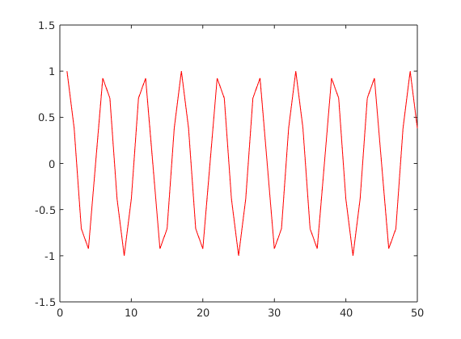
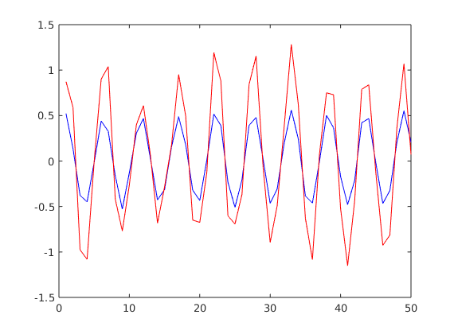

<style type="text/css">

 .image_resize {
        width:570px;
    }
    .image_resize img {
        width:85%;
    }

 .image_resize2 {
        width:570px;
    }
    .image_resize2 img {
        width:20%;
    }

</style>

# MATLAB Exercise 2

## Illustration of analysis - synthesis 
Based On 2007 Moed A Q. 3

## 1. FBS Analysis/Synthesis 
### Analysis Cell code
```matlab
%% STFT of a single-frequency signal

% Analysis filter half-size 
Lh = 1024;
% the index _n_ for creating the analysis window
nh=(-Lh:Lh-1)';

% DFT length
M=64;

% ANALYSIS FILTER
% if we wanted to calculate the sinc from the sine function:
%%% w_analysis = sin(pi*nh/M)./(pi*nh);
%%% w_analysis(1025)=1/M;

% using matlab's signal processing toolbox sinc function:
w_analysis = sinc(nh/M)/M;


% CREATE INPUT SIGNAL
k1 = 12; % an arbitrary frequency for the input signal
ns = (0:(1024*32-1))'; % the index _n_ for the signal
s = cos(2*pi*k1*ns/M); % the signal


% STFT
s_zeropad = [zeros(Lh,1); s; zeros(Lh-1,1)]; % the analysis filter "eats up" 2*Lh-1 samples from the output
S = my_stft(s_zeropad,w_analysis,1,M);
t = abs(S);
figure();
h=pcolor(t(1:64,:));
set(h,'EdgeColor','None')
```

<div style="height: 100px;">
</div>


### Cell output
As expected, the periodogram does not change over time (hence the horizontal symmetry).
Since the chosen band is $k=12$, we see periodogram peaks at bands $12$ and $64-12=52$.


<div style="height: 500px;">
</div>

### Synthesis cell code
```matlab
%% FBS syntesis (requires previous cell)

% calcualte the baseband factor
[NFFT, n_slices] = size(S);
n = (0:n_slices-1);
k = (0:NFFT-1)';
% since _k_ is column and _n_ is row, 
% multiplying them will get their cartesian-product matrix:
baseband = (2*pi/NFFT)*k*n; 

% We are not running the istft function.
% Instead, preform the inverse baseband shift 
% and sum the STFT coefficients:
Sbb = S .* exp(1i*baseband); % shift back from baseband

r = sum(Sbb)'; % recounstructed signal

% RESULTS
% check the signal is real
sprintf('imaginary part: %.2f dB', ...
    10*log10( ... 
        norm(imag(r)) / norm(real(r)) ...
        )...
)
    
sprintf('Reconstruction error: %.2f dB',10*log10(norm(r-s)/norm(s)))
% plot the reconstructed signal on the original
figure(); plot(real(r(1:50)),'b-');
hold on; plot(s(1:50),'r-')
```

### Cell Output - Sinc analysis filter (satisifies perfect reconstruction condition)
The norm of the difference between the signals is well within the expected numeric noise.
The plot illustrates the two graphs perfectly overlap (up to the resolution of this graphic)

```
ans =

    'imaginary part: -161.38 dB'


ans =

    'Reconstruction error: -153.15 dB'
```




### Cell Output - Rectangular analysis filter
Here we use a filter that is not suited for FBS reconstruction, since it does not have zero coefficients at n=M, 2M, 3M,... and therefore fails the Portonoff perfect reconstruction condition.

The result is poor reconstruction. I have used three signals to test this system and illustrate its reconstruction fidelity:
- Perfect sinusoid
- Sinusoid + noise
- white noise

Here are the three graphs for these signals:

<div class="image_resize">


</div>

````
'Reconstruction error: -12.43 dB'
````

Observe, however, that the reconstructed signal is actually the same as the original, up to a gain. This will hold for any signal of period M. The reason for this is that since the synthesis filter is just a delta function, the effect of the M'th coefficient of the filter (which should be zero) is to create a shifted image of the original signal, with shift M.


#### Rectangular window, noisy sine wave

<div class="image_resize">


</div>

````
'Reconstruction error: -5.70 dB'
````

We observe a _better_ SNR here than the pure sine wave. The reason is that the reconstructed signal is pretty much the same signal, as the filter tends to average out the noise. The original signal however has a higher variance, leading the SNR metric to improve.  

#### Rectangular window, Gaussian white noise

<div class="image_resize">


</div>

````
'Reconstruction error: -0.11 dB'
````

The nonperiodic signal's reconstruction is poor.


## Question 3 Part 2 - WOLA

When $R=\frac{M}{2}$ Portonoff condition holds with boxcar analysis and synthesis filters, since for every $n$, there are exactly 2 points of $f$ and $h$ which add to the sum.
This conclusion can be extended for any R which divides M exactly. However,
* The first and last M samples will not be accurately reconstructed (due to "missing" overlaps in the OLA)
* The synthesis filter should be scaled by $\frac{R}{M}$ to maintain a reconstruction coefficient of 1.

#### OLA with M=64, R=64, h=rectwin(64), f=rectwin(64)
The signal is a noisy sinus which is _not_ M-periodic (the period length is not a divisor of M)

<div class="image_resize">


</div>

````
    'Reconstruction error: -316.22 dB'
````

#### OLA with M=64, R=32, h=rectwin(64), f=0.5*rectwin(64)

<div class="image_resize">


</div>

````
    'Reconstruction error: -316.34 dB'
````

#### OLA with M=64, R=8, h=rectwin(64), f=0.125*rectwin(64)

<div class="image_resize">


</div>
````
    'Reconstruction error: -317.87 dB'
````


##### cell code
````matlab
%% WOLA analysis
mr_ratio = 8;
M = 64;
R = floor(M/mr_ratio);
Lh = M;
Lf = M; 
w_analysis = rectwin(Lh);
w_synthesis = w_analysis/mr_ratio;

% CREATE INPUT SIGNAL
input_signal_type = 'noisy_sinus';     % 'noise';  %   'sinusoidal';; 
s = create_input_signal(input_signal_type,512,M*5);

% Transform
S = my_stft(s,w_analysis,R,M);
r = my_istft(S,w_synthesis,R);

tt = M: length(r)-M;
sprintf('Reconstruction error: %.2f dB',10*log10(var(r(tt)-s(tt))/var(s(tt))))

figure();
plot(real(s))
hold on
plot(real(r))


````        
