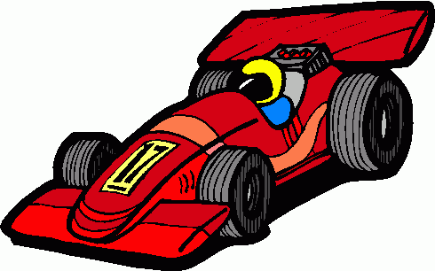
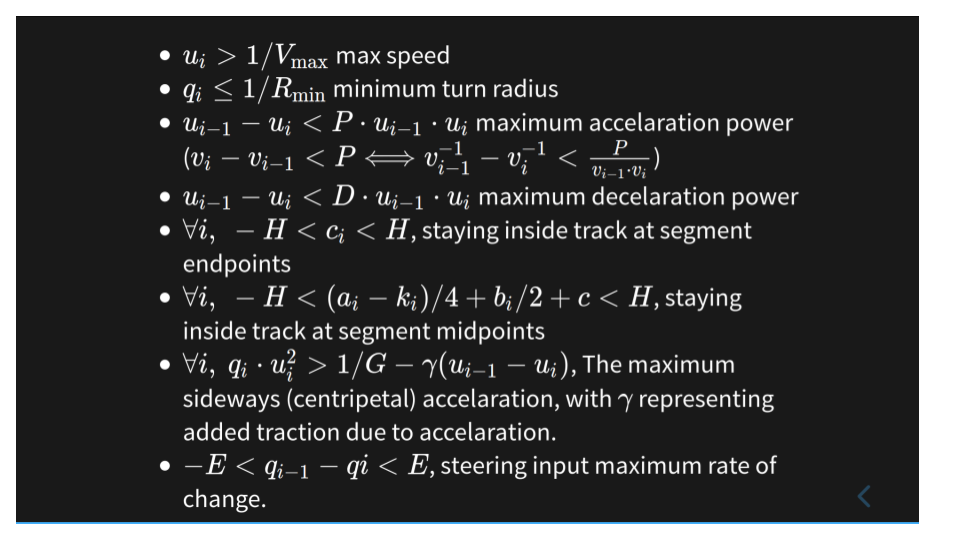

# The Race Track Problem

---

### Time Trial Racing

<u style="color:#A0CFA0;text-decoration:none">

* <!-- .element: class="fragment" --> Complete the lap as fast as possible 

<b>optimization goal</b> <!-- .element: class="fragment" -->

</u>

<u style="color:#C050F0;text-decoration:none">

* <!-- .element: class="fragment" --> Don't stray out of the paved track 

<b>constraints</b> <!-- .element: class="fragment" -->

---

### Track geometry 
* Piecewise parabolic segments with $\mathbf{C^1}$-continuity
* Width of pavement is $H$.

&rArr; The equation of each track's segment _centerline_ is 
$$y=k_i\cdot x^2$$
in the track segment's coordinate system

&rArr; constraints: $-H \le y_{car}-k_i \cdot x^2 \le H$

---

### Car modeling

* Car's distance from centerline: $y_{car}(x)$ <!-- .element: class="fragment" -->
* $y_{car}(x)$ is also piecewise-parabolic <!-- .element: class="fragment" -->
* The curvature is the amount of steering<!-- .element: class="fragment" -->
* The acceleration controlled by gas/ brake pedals.<!-- .element: class="fragment" -->

---

### Optimization problem formulation
$$\min \sum\limits_{i=1}^N (u_i+u_{i-1})/2= \min \frac{1}{2}u_N+\sum \limits_{i=1}^{N-1}u_i$$

---

* $u_i \gt 1/V_{\max}$  max speed
* $q_i \le 1/R_{\min}$ minimum turn radius
* $u_{i-1}-u_i \lt P\cdot u_{i-1}\cdot u_i$ maximum accelaration power ($v_i-v_{i-1} \lt P \Longleftrightarrow v_{i-1}^{-1}-v_i^{-1} \lt \frac{P}{v_{i-1}\cdot v_i}$) 
* $u_{i-1}-u_i \lt D\cdot u_{i-1}\cdot u_i$ maximum decelaration power
* $\forall i,\ -H \lt c_i \lt H$, staying inside track at segment endpoints
* $\forall i,\ -H \lt (a_i-k_i)/4+b_i/2+c \lt H$, staying inside track at segment midpoints
* $\forall i,\ q_i\cdot u_i^2 \gt 1/G - \gamma (u_{i-1}-u_i)$, The maximum sideways (centripetal) accelaration, with $\gamma$ representing added traction due to accelaration.
* $-E \lt q_{i-1}-q{i} \lt E$, steering input maximum rate of change.
