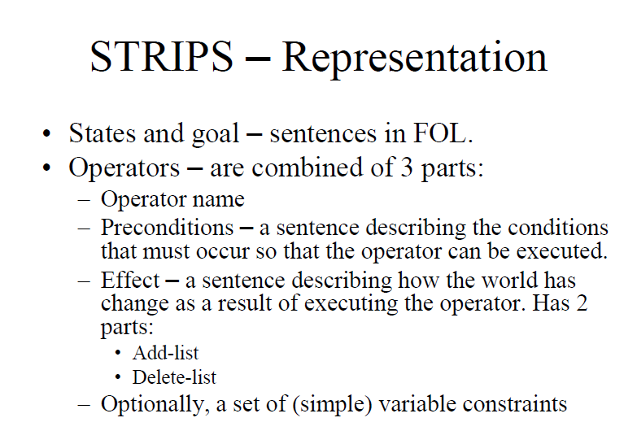

# Artificial Intelligence 
----
___Nov. 1 2018___

#### Complexity notation
- b - branching factor
- m - depth of tree (not depth of solution)

A few points on comple
DFS has better memory complexity than BFS

#### IDS iterative deepening
Check up to a certain depth, if found solution great, otherwise go deeper.

The memory complexity of IDS is b*d rather than $b^d$ in BFS.
It is not BFS even with L =1. BFS would discover a row.
This Dijkstra. requires priority queue.

we aren't going into memory complexity.

worked out in class example from exam 2014 moed bet

- DFS: 
    - open:
    - closed:

- IDS:
    - open: S | SABC | SABCDG
    - closed: S | SABC | SADG

- UCS (Dijkstra):
    - closed: SCBBDFAG
    - open: s (0)
    A 6
    B 2
    C 1
    B 4
    F 5
    E 7
    D 4
    E 8
    D 6
    E 10
    F 9
    G 6
    G 26

### lecture 3 informed search
slide 4 a good heuristic:
- goes down as you near the goal
- admissible: the computation of the heuristic should be simpler than the true calculation

----
Nov. 8 2018

ex1.: python or java
will be uploaded to the course site

consistent: $h(n) - h(n') \leq C(n,n')$ 
where $h$ is the heuristic and $n,n'$ are two nodes

The monotnity is not a must. consistent <-> montonic
admissable <-> underestimate.

#### Best FS algorith pseudo code
1. start with open=initial state
2. while...

#### A* and IDA*
A* prioritizes based on a combination of the true cost so far and the heuristic to gauge the cost to the goal.

IDA* using threshold  - example
- A: 12 b: 2 c: 8
- A's $g$ is larger than the current threshold (which was set as $g(s)=8$)
- continue with B and C, starting with B
- B goes to to c:6 and F:8
- c goes to G3: 11. above threshold
- F goes to d: 4 
- d goes to g2: 9 above threshold
- my list is empty. I rerun the whole thing with a threshold of 9. Now I will reach G2 which has a cost of 9.

- note we only use g for the threshold, not for prioritizing. a stack is good enough here.

- if you were'nt told about duplicate pruning, you may implement the algorithm without closed list and it will go into looops.

----
Nov. 22

### Perfect Information Games
Either a max- game or a min -

Leaf represents the final state - Win, lose, tie.

The game is formulated as a "max player" (trying to maximize own gain) and "min player) (minimizing other's)

pseudo-code (slide 6): recursive with alternation between the value maximizers and minimizer

#### $\alpha-\beta$ pruning
saves exploration where a branch is clearly good for the other, but bad for the current player.
We say that $\alpha$ equals 3 (the best value of the max-playrer)

example on the board (to be uploaded)

----
Nov. 29
STRIPS algo
First Order Logic
תורת הפסוקים
predicates
First Order Logic

clear(A)
on(B,A)

---- 
Dec. 6 review practice session
the $\alpha-\beta$ pruning algo for minmax
- $\alpha$: Max's best value. min: will trim if $v < \alpha$
- $\beta$: Min's best value. max: will trim if $v > \beta$

----
Dec. 13 Machine Learning intro
