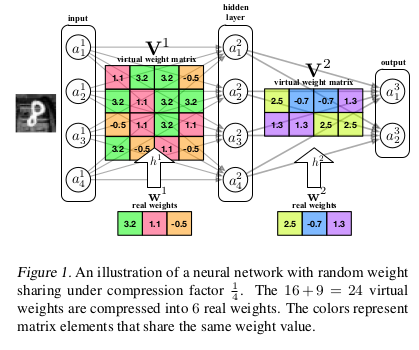

# Neural Network compression

---

## (My) Definition
> A procedure which results in an ANN that can perform a task similarly to an existing ANN, consuming considerably less computational resources per processed sample, and typically having a more compact representation.

---

## Reading covered so far
* A few prominent compression methods for Deep Neural networks
* Not covered yet
    * Papers referring specifically to sequence models
    * Methods that rely directly on an uncompressed network e.g. "brain damage" 

---

## Main Takeaway
There are many approaches, and all of them work exceptionally well!
 
*  <!-- .element: style="color: #202020;" -->
*  <!-- .element: style="color: #202020;" -->
*  <!-- .element: style="color: #202020;" -->
*  <!-- .element: style="color: #202020;" -->
*  <!-- .element: style="color: #202020;" -->

---

| Approach | Benefit |
| --- | --- |
| Coarsening the "grid" of potential vectors  | up 100x faster |
| Constraining different entries of a connection matrix to the same value | 4x reduction in number of parameters |
| Limiting the search space of connection matrix vectors |  ?x compression | 

---

## Binarization
**Concept:**  Develop an MLP with all connections weights restricted to +1 and -1
* Successfully trained a binarized MLP for a classification task <!-- .element: class="fragment" -->
* Moderate increase in number of nodes per layer  <!-- .element: class="fragment" -->
* computations can be reduced by ~6*10&sup2;: <!-- .element: class="fragment" -->

| bits | bit ops to mult 2 numbers | 
| ---- | ----- |
| 32   | 600 |
| 1    | 1 (XNOR) |
 <!-- .element: class="fragment" --> 

---

### Binarization - Limitations
* Requires special kernel/ hardware - otherwise no gain <!-- .element: class="fragment" -->
* Not fully binarized:  <!-- .element: class="fragment" -->
    * Inputs are floating point numbers <!-- .element: class="fragment" -->
    * Class scores are integers <!-- .element: class="fragment" -->
* So needs both special- and general-purpose HW <!-- .element: class="fragment" -->

---

### Binarization - Analysis
* Any vectors can be represented as a length $\\mathcal{l} \\in \\mathbb{R}^+$ and directions `$\phi _1, \phi_2, ... \phi_{d-1} \in (0, 2 \pi)$`
* Ordinary networks' connections are vectors in this "continuous" space
* Binary Networks are restricted to:
    * Constant length
    * Discrete directions $\\{\pm1\\}^d$
* Yet they do well 
    * at least in classification tasks

---

### Repeating elements in a connection matrix

**Concept**: Save memory and mult-ops by arbitrarily constraining different entries to the same value 

---

### Repeating elements in a connection matrix

**Concept**: Save memory and mult-ops by arbitrarily constraining different entries to the same value.

* Decide on `$K^{(\mathcal{l})}$`, free parameters per layer, `$K^{(\mathcal{l})} \ll M^{(\mathcal{l})} \times N^{(\mathcal{l})}$`
* Create a hash function `$h: [M] \times [N] \to [K]$` 
* Set `$w_{ij} = K_{h(i,j)}$`

---

### Repeating elements - Analysis
* Simple and fairly generic (CNNs, RNNs, ...) <!-- .element: class="fragment" -->
* Controllable compression factor  <!-- .element: class="fragment" -->
* outperforms other methods <!-- .element: class="fragment" -->
    * especially for strong compressions 1:64
    * &frac12;  bit per entry! <!-- .element: class="fragment" -->
* <!-- .element: class="fragment" --> Mathematically equivalent to _feature_ hashing 
* Heuristic <!-- .element: class="fragment" -->

 I believe that understanding this method's success is of fundamental importance <!-- .element: style="color: aqua" class="fragment" -->

---

### Factorization
* Concept: Train $UV$ rather than $W$, where $U$ and $V$ are low rank.
* Not all authors agree on the effectiveness: 
    * one paper argues that U has to be predetermined
    * A "smooth" $U$ works well in image processing context.
* Factorization performed very poorly in the benchmark conducted by the _Hashing Trick_ authors.

---

### Batch Normalization
* Not a compression method
* Concept: 
    * Speed up training by deliberately eliminating the scale and bias of inputs to a layer
    * Replace the implicit scale and bias of the input population with explicit, learnable scale and bias 
* Faster training led to out-performing state-of-the-art of the time
* Is this "Weak" factorization?

---

### Summary 
* Overlap between approaches
    * But a broader, more systematic framework is needed
* Train-from-scratch vs. rely on existing network: 
    * Train from scratch received more emphasis.
    * Maybe becuase it's easier when training data is not too big and openly available.
    * Training on soft outputs is straightforward
    * Did anyone try a method that compares hidden activations?

---

### Ideas to further develop
* Interpretations for "action" of a layer
    * Rotate &rarr; stretch/reflect &rarr; rotate (the SVD approach)  <!-- .element: class="fragment" -->
        * &rarr; then "squash" (nonlinearity) <!-- .element: class="fragment" -->
    * "features" or "projections" / "voting" system <!-- .element: class="fragment" -->
* Avoiding the heavy parameterization of the final layer <!-- .element: class="fragment" -->
    * having all possible classes compete "head to head" seems redundant <!-- .element: class="fragment" -->
* 

All above approaches train a new model from scratch, using the same training data as the original network

---

