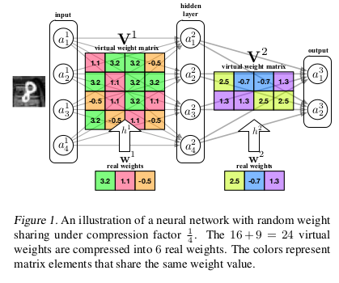

# Neural Networks:
## compression
## and constrained learning

---

### Neural Network Compression 
> A procedure which reduces the size of a network with an acceptable impact on its test accuracy

---

### The _Efficient Frontier_ analogy
#### EF in finance

---

---

---

---

## MLP CLASSIFIERS

---

### MLP Layer

* $z = xW+b$
* $a = g(z)$ nonlinearity, e.g. $a=\tanh(z)$
* dims:
    * $z \in \mathbb{R}^{1 \times n}$
    * $a \in \mathbb{R}^{1 \times m}$
    * $W \in \mathbb{R}^{m\times n}$
    * $b \in \mathbb{R}^{1 \times n}$

---

### Single activation - intuition
Let $\vec{W_j}$ denote a column of $W$.

Then $z_i = \vec{W_j} \cdot \vec{x}+b_i$
* The _direction_ of $\vec{W_j}$ is the "feature"
* The _magnitude_ of $\vec{W_j}$ determines the "thickness" of the transition.
* For cross-entropy loss, good features will tend to grow in magnitude.
* The _bias_ term $b_i$ determines _where_ the separation between positive and negative values occurs.

---

## Compression approaches
* Reducing bit depth
* Reducing the number of free parameters in $W$
* Modified training procedure

---

## Binarized networks 
#### (Courbariaux _et al._ 2016)
**Concept:**  Develop an MLP with all connections weights restricted to +1 and -1

---

## Binarized networks <!-- .element: align="left" -->
#### <!-- .element: style="color: #808080" align="left" --> (Courbariaux _et al._ 2016)  

 **Concept:**  Develop an MLP with all connections weights restricted to +1 and -1 

#### Overview  <!-- .element: align="left" -->
* Successfully trained a "BNN" (binarized neural network) on an image classification task <!-- .element: class="fragment" -->
* Reached same performance as reference network  <!-- .element: class="fragment" -->
* with just a modest increase in number of nodes per layer  <!-- .element: class="fragment" -->

---

#### Binarized networks (cont.)  <!-- .element: align="left" -->
### Benefits  <!-- .element: align="left" -->
* <!-- .element: class="fragment" data-fragment-index="1" --> Demonstrated **7x** feed-forward time reduction (through custom CUDA kernel) 
* Theoretical computation reduction bound (for same-size network): ~6*10&sup2;: <!-- .element: class="fragment" data-fragment-index="2" -->
    * Multiply two 32-bit floating-point numbers: ~**600 ops**
    * Multiply two 1-bit numbers: **1 op** (XNOR gate)
* Further potential speed benefit by exploiting repeating columns.

---

#### Binarized networks (cont.)  <!-- .element: align="left" -->
### Limitations  <!-- .element: align="left" -->
* Speedup depends on either custom hardware or custom kernel.
* Training requires special code and may take more cycles.
* First layer, final layer, and training are not binarized.
* Proven only for image classification problems.

---

#### Binarized networks (cont.)  <!-- .element: align="left" -->
### Analysis of space discretization:
* Arbitrary $m \times n$ matrices: Vectors of arbitrary length and spatial angle: 
    * Length $\\mathcal{l} \\in \\mathbb{R}^+$, and angle `$\left\{ \phi _1, \phi_2, ... \phi_{d-1}\right\} \in (0, 2 \pi)^{m-1}$`
* BNN matrix columns &xhArr; Constrained vectors: <!-- .element: class="fragment" -->
    * `$\mathcal{l} = \sqrt{d}$`
    * `$\hat{\phi_i} \cdot \hat{\phi_j} = \cos \theta_{ij} \in \pm(1-\frac{2k}{d})$` where `$k = 1,\ldots,d/2$`

    

---

### Binarization - Conclusions
BNN success demonstrates redundancies in ANN representation power:

* Length is not necessary to represent "states"  <!-- .element: class="fragment" -->
* All activations are saturated  <!-- .element: class="fragment" -->
* Good solutions do not require "infinite" resolution in input space.  <!-- .element: class="fragment" -->

Note: XNOR gates span the complete functional space.  <!-- .element: class="fragment" -->

---

### Constraining network structure
* Reduce bit depth
* Reduce the number of free parameters in $W$:
    * hard structure
    * soft structure
    * unstructured

### Smarter training
* _distillation_: Train a "student" network on outputs of "teacher" network
* Batch Normalization

### Post training
* Remove very similar features occurring in same layer 

---

## Compression approaches

### Not encountered in literature
* Concatenate output of a (deep) layer with outputs from a previous layer
* Detect correlation between neurons (in same layer or different layers)
* Stochastic neuron activation

---

 

| Imposed Constraint | Interpretation | Benefit |
| --- | --- | --- |
| Low bit depth | Coarser search-grid | up to 100x faster |
| "Fix together" arbitrary connection elements  | Impose correlations between columns | 4x reduction in number of parameters |
| Matrix separated into 2 low-rank matrices | Columns constrained to a subspace | ?x compression | 

---

## Repeating elements in a connection matrix
  <!-- .element: class="fragment shrink" data-fragment-index="2" --> 

  **Concept**: Save memory and multiplications, by arbitrarily constraining different entries to the same value  

---

### Repeating elements in a connection matrix

---

### Repeating elements in a connection matrix
* Decide on `$K^{(\mathcal{l})}$`, free parameters per layer, `$K^{(\mathcal{l})} \ll M^{(\mathcal{l})} \times N^{(\mathcal{l})}$`
* Create a hash function `$h: [M] \times [N] \to [K]$` 
* Set `$V_{ij} = w_{h(i,j)}$`
    * $V_{ij}$ is the (virtual) connection matrix
    * $w_{(\cdot)}$ is a vector of $K$ parameters

---

### Repeating elements - Analysis
* Simple and fairly generic (CNNs, RNNs, ...) <!-- .element: class="fragment" -->
* Adjustable compression factor which exceeds binarization  <!-- .element: class="fragment" -->
    * 1:64  &xhArr; &frac12; bit per entry! 
* outperforms other methods(?) <!-- .element: class="fragment" -->

 

---

### Connection hashing vs. feature hashing

For $z_i$ (the layer outputs pre-nonlinearity):
 
 `$z_i = \sum\limits_{j=1}^{m} V_{ij}a_j$`

Equivalently 
`$z_i = \mathbf{w}^T\phi_i(\mathbf{a})$`
Where

`$$[\phi_i(\mathbf{a})]_k = \sum\limits_{j:h(i,j)=k}a_j$$`

Which means that each $z_i$ depends on a sum of an arbitrary subset of the previous layer's activations $a_1,\ldots,a_m$

---

## Factorization

---

### Factorization
* Concept: reduce the number of free parameters in a fully-connected layer without alterating matrix shape"Generate"  $W \in \mathbb{R}^{m \times n}$ from $UV,\ U \in \mathbb{R}^{m \times k}, V \in \mathbb{R}^{k \times n}$
* Number of parameters drops from $mn$ to $(m+n)k$

---

### Factorization
* Not all authors agree on the effectiveness: 
    * $U$ and $V$ "cannot be trained together" 
    * $U$ as a "feature bank" 
    * Predetermined by network designer 
    * or pretrained
* In image processing, "smooth" $U$'s work well.

This approach performed worst in the benchmark conducted by the _Hashing Trick_ authors.

---

## Batch Normalization

Concept: Speed up training by deliberately eliminating the scale and bias of inputs to a layer

---

### Batch Normalization
<h5 align="left"> Concept (cont.): </h5>
* Speed up training by deliberately eliminating the scale and bias of inputs to a layer
* Replace the implicit scale and bias of the input population with explicit, learnable scale and bias 

<h5 align="left"> Accomplished: </h5>
* Achieved faster training and surpassed state-of-the-art performance in image processing
* Is this a "Weaker" form of factorization?

---

## SUMMARY 
* Approaches "overlap"
* No theoretical framework
* One successful application is not enough to understand approach
* Smaller networks which "disguise themselves" as larger ones
* Looks like everyone is trying to fool SGD...

---

## NEXT STEPS

#### Further Reading
* Sequence models - training and compression
* Architecture evolution
* Training on "soft" scores
* SGD analysis

---

## NEXT STEPS

#### Reasearch
* Implement ordinary vs. hashed MLP and look into training process
* Design a problem with a known solution and check the solutions reached by SGD

#### Ideas to further develop
* Decision-tree-like splits
* Correlations and linear dependence between activations

---

#  THANK YOU!

---