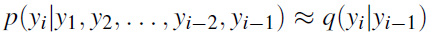
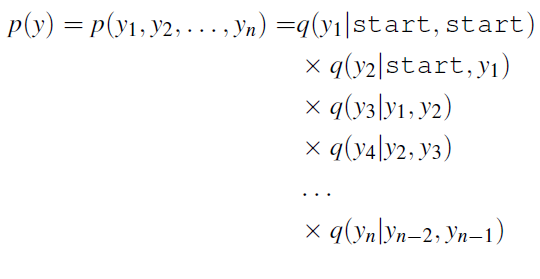
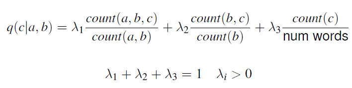
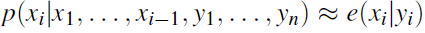
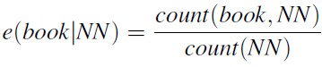
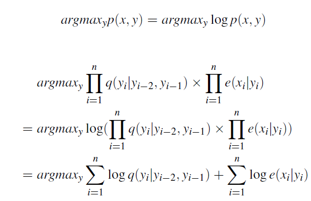

## feature based discrimintive models 
(הרצאה 2 25.10 החל מאחרי ההפסקה)

כעת נראה גישה פחות מבוססת הסתברויות ויותר פיצ'רים. מי שמכיר זה יהיה לו איטי, מי שלא זה יהיה לו מהיר

useful indicators
- identity of L
- identity of R
- length of length
- is R capitalized
- ...

במקום לחשב P(y|x), אחשב ציון score(x,y)

החזר argmax.

מסביר מה קורה במאמר של הboundary. יצר פיצ'ר לכל מילה שראה, פעם פיצר לימין ופעם לשמאל. לזה קוראים one-hot.
יש 2 כפול אוצר המילים ובנוסף פיצר לפי האורך של המילה. 
אני מניח שכל מילה עצמאית, למשל אין לי פיצר "האם המילה היא שם".

אני מייצג את הוקטור בייצוג דליל כי הוא sparse.
אפשר גם לייצר hash table. שני הייצוגים חוסכים מקום ביחס ליצוג מלא.

ומכאן - הכל machine learning.
שקף 14 מראה איזה כלי ML משתמשים היום. NN נמצא איפשהו למטה, הוא לא מאוד פופולרי

the hard part is to find an annotated corpus and choosing a good set of features. the rest are more technical.

### Linear models
remark (in response to a question) i prefer probability to scores, because probs hav e universal interpretations.

#### Binary linear classifier (2b:16)
a single score and a threshold for determining the class (true/false)

p. 20 i have |y| different w vectors which I train for each class

setting weights for the multiclass algorithm:

This is actually not a good solution.
I will look at each updated w as an element in a series.
The actuall w will be the avg, using an online averaging algorithm.

intuitively, by looking at longer ranges we can eliminate weights for oscillative features while retaining the weights of oscillative features.

we revisit the binary pp-attachement problem verb/noun to include verb/noun/other. our feature generation template includes singles, pairs, triplets and quadruplet. If I have 25,000 tagged words I'll have 25,000 x 11 features.

2b:26 how are we going to apply a model that depends on the label? (stud q). The classification will calculate the score with each y

additional features, based on an untagged large corpus:
- did we see the (n1, p) pair in a 5 word window in a big corpus?

## Parts of speech
the parts are still debated. is "the" an adjective? (a determiner) some say yes, because some languages don't distinguish them.

"noun phrases".

some words (strings) are pronounced differently.

## bigram viterbi
הרצאה 29.10 שעה 12:50

a dynamic programming algorithm. 
I use the best probability 

In each step a table of n * k ^2 

trigram not so complex, but a little different
for trigrams it is n * k ^3

I still would like to prune, to reduce |k| by eliminating zero- or very small- probability tags in certain position.

what is the score of the best path for reach noun in position 4. I do it by looking at all the options in position 3. 

beam search - besk k in every step. not necessary, the full algo is not too heavy.

in this algoirthm i am getting the best score, so I need to remember the dequences as well. the only hting not obvious is that the max and argmax is a loop. i

using second-order markov works better. I "need" those extra dependencies. It will be k times slower, which is significant. also requires more memory. why not go to quadruplets? more computation, sparsity problem. 

I will always encounter workds that weren't in the training. even if I saw once (e.g. book <-> noun) it's not reliable. 
How do I solve that?

1. I replace any unknown word with "unk". how do I train for this? e.g. a word that exists once i also add it to the corpus as unk. 

all unk's will have the same behavior, but not the same tagging. it depends on the markov dependencies.

a finer solution is to use different unk's based on "signature", a morphology of the word. I still need to make sure each word will be mapped to a single signature.
How to calculate the signatures' probabilities? can take 10%

we stopped at slide 51

exercise: do everything related to hmm

### POS Tagging - The HMM approach (my summary)
#### point (word) estimates
Part of speech (POS) tagging requires as to map each word to one of 36 categories.
Naively our task is to find $P(\{y_i\})|\{x_i\})$ where $\{y_i\}$ are the tags in the sentence and $\{x_i\}$ are the words. This requires a lookup table that is exponential in the dictionary and therefore clearly not viable.

So we apply Bayesian Inference principles:
- $P(y|x)P(x) = P(x,y) = P(x|y)P(y)$ where $P(x)$ is irrelevant as it is constant.
- now we only need the (unconditional) probability of each tag $y$ and its "qualifier" $P(x|y)$ 
- Starting with the **un**conditional probability $P(y)$:
    - It does not depend on $x$, but it does depend on previous $y$'s.
    - If we assume dependence on the previous tag only:
         
    - Since $P(y_{i-1})$ dependes on $P(y_{i-2})$ and so forth this results in a chain.
    - We actually prefer a Markovian chain of order two:
    
    - These can be estimated using MLE.
    - But for robustness, we prefer an MLE with fallbacks fewere dependencies:
      
    - Note the estimated chain-conditional probabilities are called *transition probabilities* and denoted $q(y_i)$ 

- Now for the conditional probabilty $P(x|y)$:
    - We make a very bold independence assumption: we will compare just the probabilities of the word conditional with the specific tag:
    
    - and estimate them using MLE:
    
    - These are called *emission probabilities* and denoted $e_i$.

- To avoid multiplying probabilities we work with the $\log$s:

#### From single word estimates to sentence-level $\arg \max$
We still have a search problem on our hand since we want to maximize the tag sequence, not just single tags.

The greedy sequential solution is $O(kn)$ where $n$ are the words and $k$ are the tags.

**Viterbi** devised a dynamic-programming solution. Its invention dates back to 1967 and is useful in the context of decoding convolutional codes, such that exist in wireless communication, genome sequencing and more.

This algorithm generates a path $Y=(y_1,y_2,\ldots,y_N)$, which is a sequence of states $y_t \in S=\{s_1,s_2,\dots,s_T\}$ that generate the observations $X=(x_1,x_2,\ldots, x_N)$ with $x_n \in  O=\{o_1,o_2,\dots,o_W\}$ ($W$ being the count of observations (observation space, see below)).

Two 2-dimensional tables of size $T \times N$ are constructed:

* Each element $V[i,j]$ of $V$ stores the probability of the most likely path so far:
 $\hat{Y}=(\hat{y}_1,\hat{y}_2,\ldots,\hat{y}_j)$ with $\hat{y}_j=s_i$ that generates 
 $X=(x_1,x_2,\ldots, x_j)$.
* Each element $bp[i,j]$ of $bp$ stores $\hat{y}_{j-1}$ of the most likely path so far 
$\hat{Y}=(\hat{y}_1,\hat{y}_2,\ldots,\hat{y}_{j-1},\hat{y}_j = s_i)$ for $\forall j, 2\leq j \leq T $

The table entries $V[i,j],bp[i,j]$ are filled by increasing order of $T\cdot j+i$.

$V[i,j]=\max_{k}{(V[k,j-1]\cdot Q_{ki}\cdot E_{ix_j})}$, and
$bp[i,j]=\operatorname{argmax}_{k}{(V[k,j-1]\cdot Q_{ki}\cdot E_{ix_j})}$,

with $Q_{ki}$ and $E_{iy_j}$ as defined below. Note that $E_{ix_j}$ does not need to appear in the latter expression, as it's non-negative and independent of $k$ and thus does not affect the argmax.

-----
Nov. 12 2018
(missed first part)
slide 30 now I have an argmax in there. y' is a much bigger class but I can find the right one using viterbi.

### segmentation
it's harder to say correct/incorrect because some of the spans are tagged and some aren't.
- Correct sentences - too harsh. hard to get there
- each sequence on its own. measure percision and recall: correct predictions of all predictions and correct predicition of segments you were "supposed" to find.
together they form a good balance between being too confident to being too timid.

slide 60: if I use only sequences I observed in the training i may be aming for recall because other patterns i didn't observed will be missed.
this will be depenedent on the accuracy of the POS-tagger and specific to a particular task (NP-chunk). So if I am focused on a very specific problem that's good enough. o/w I want to do machine learning.

the _[, ] , ][, None_ is very local, for example I will learn _None_ inside and outside of brackets. also we need to complicate in order to take into account whether I'm inside an open bracket or not.

[[not fully understood how this is learned. slide 100]]

BIO tagging is sufficient. Adding Single and Ending doesn't add "power" but might help learning. I am more sensitive to differences between words that usually appear alone (single), and in the end (for example LTD in the name of a company)

slide 123: cheaper. but i miss features such as length of sequence. works almost as good but much faster.

 

