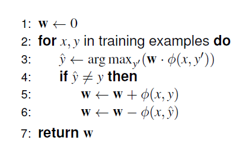

## feature based discrimintive models 
(הרצאה 2 25.10 החל מאחרי ההפסקה)

כעת נראה גישה פחות מבוססת הסתברויות ויותר פיצ'רים. מי שמכיר זה יהיה לו איטי, מי שלא זה יהיה לו מהיר

useful indicators
- identity of L
- identity of R
- length of length
- is R capitalized
- ...

במקום לחשב P(y|x), אחשב ציון score(x,y)

החזר argmax.

מסביר מה קורה במאמר של הboundary. יצר פיצ'ר לכל מילה שראה, פעם פיצר לימין ופעם לשמאל. לזה קוראים one-hot.
יש 2 כפול אוצר המילים ובנוסף פיצר לפי האורך של המילה. 
אני מניח שכל מילה עצמאית, למשל אין לי פיצר "האם המילה היא שם".

אני מייצג את הוקטור בייצוג דליל כי הוא sparse.
אפשר גם לייצר hash table. שני הייצוגים חוסכים מקום ביחס ליצוג מלא.

ומכאן - הכל machine learning.
שקף 14 מראה איזה כלי ML משתמשים היום. NN נמצא איפשהו למטה, הוא לא מאוד פופולרי

the hard part is to find an annotated corpus and choosing a good set of features. the rest are more technical.

### Linear models
remark (in response to a question) i prefer probability to scores, because probs hav e universal interpretations.

#### Binary linear classifier (2b:16)
a single score and a threshold for determining the class (true/false)

p. 20 i have |y| different w vectors which I train for each class

setting weights for the multiclass algorithm:

This is actually not a good solution.
I will look at each updated w as an element in a series.
The actuall w will be the avg, using an online averaging algorithm.

intuitively, by looking at longer ranges we can eliminate weights for oscillative features while retaining the weights of oscillative features.

we revisit the binary pp-attachement problem verb/noun to include verb/noun/other. our feature generation template includes singles, pairs, triplets and quadruplet. If I have 25,000 tagged words I'll have 25,000 x 11 features.

2b:26 how are we going to apply a model that depends on the label? (stud q). The classification will calculate the score with each y

additional features, based on an untagged large corpus:
- did we see the (n1, p) pair in a 5 word window in a big corpus?

## Parts of speech
the parts are still debated. is "the" an adjective? (a determiner) some say yes, because some languages don't distinguish them.

"noun phrases".

some words (strings) are pronounced differently.

