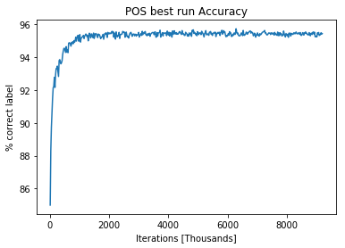
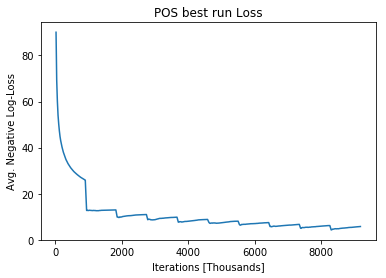
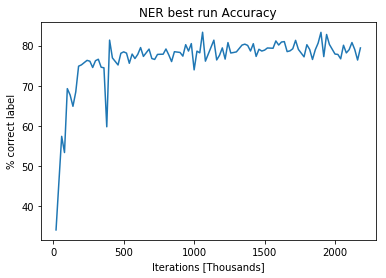
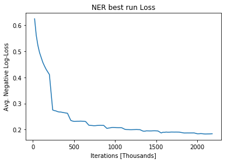

# Assignment 2 Part 1

----
_29 Nov 2018_
_Shahar Siegman_ 011862141

### Best model for POS
#### Model Overview
The network implemented:
$$
\mathbf{\hat{y}} = \mathrm{softmax}(\mathbf{U} * (\tanh(\mathbf{Wx} + \mathbf{b})) + \mathbf{b'})
$$

- $\mathbf{x}$: $50 \cdot 5 =250$, concatenated columns of an embedding matrix $\mathbf{E}$.
- $\mathbf{W}$ is $400 \times 50$ i.e. the hidden layer's size is 400.
- The inital Learning Rate was set to $0.15$, using Dynet's default Learning Rate scheme.

#### Other considerations
- **Unknown words** During prediction process, unknown words were replaced with a special symbol `**UNK**`. This symbol has its own column in the embedding matrix $\mathbf{E}$. In order to train this column, Whenever a rare word was encountered (bottom 10% of training set in terms of word frequency), its 5-tuple was sent to the training process with the word replaced by the `**UNK**` symbol.
- **Case sensitive** Both the training and prediction process is case-sensitive.
- **Sentence start and end** In order to correctly model the context of the two first, as well as two last words in the sentence, two additional symbols were added `**START**` and `**STOP**`. These symbols have their own embedding vectors, which are used every time a word in the beginning or at the end of the sentence goes through the training process. However they are only trained indirectly since they are never a target for POS prediction.

### Best model for NER
- Hidden layer size: 15
- L^2^ regularization with coefficient 0.02
- Initial learning rate 0.18
Other than these parameters the model is the same as for POS.

### Charts
##### POS Accuracy

##### POS loss

##### NER Accuracy

##### NER loss

