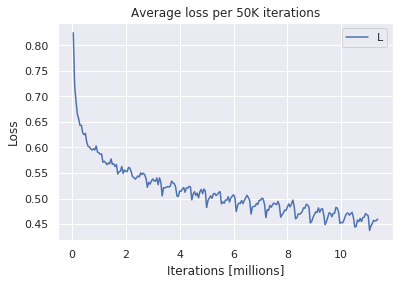
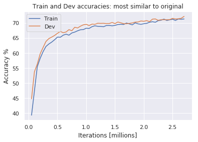

Shahar Siegman 011862141

# Methods in DL Assignment 4 Report

Summary:
* The chosen article is "A Decomposable Attention Model for Natural Language Inference" [[1](#refrences)]
* The Maximum score reached on the training and dev set was very close to 84%, but short of the authors' reported 89.5%
* The best score was achieved with slight modification of the network and inputs. The modification contributed significantly both to the max score (vs. my best reproduction of the original work) and to the convergence speed in the first 2-3 epochs. 
* The model training time was about 20 hours (wall-clock).
* Several changes and tweaks were attempted, they are discusses in detail in this report.

## I. Article overview, network architecture and motivation 
### Method overview
The authors chose a three-submodule architecture which is based on _attention_ (by now, a well-established approach), along with other standard techniques (e.g. vector concatenation and shallow MLPs). The main innovation is in implementing an LSTM-free _attention_ model. This allows intra-sentence parallelization at test time i.e. words in the sentence can be evaluated in parallel. No parallelization scheme was suggested for training. The authors discuss and analyze the asymptotic complexity of their network for prediction of a sentence pair. They found it to be $O({ld^2+dl^2})$, where $d$ represents the chosen dimension of the MLPs' largest layer, and $l$ represents sentence length in words. The term $ld^2$ originates from the (constant) number of matrix-vector multiplications per word, while the second term is related to calculating the attention. This complexity, when not considering parallelization, is on par with LSTM-based attention models. The main motivation the authors offer for their method is parallelization within-sentence. The tradeoff is that, contrary to LSTM-based models, the current model does not take into account word order, which they admit is a disadvantage of their architecture. An extension, described in a followup article by the same authors, handles word order through within-sentence attention, and achieves slighltly better scores on the SNLI dataset.

### Network architecture
The following sub-sections describe very briefly the four modules of the network proposed and tested in this article.

#### 0. Dimension reduction matrix
A trainable purely linear transformation, reduces the dimensions of the input embedding vectors (300d) to a desired smaller dimension, such as 200.

#### 1. Attend
The attention is achieved by "converting" the first- and second- sentence word embedding vectors, $a_i$ and $b_j$ respectively into $\alpha _j$ and $\beta _i$ through:

Where $e$ is a matrix defined by:

This can be thought of as finding the dot product of the original embedding vectors for each word pair (or more precisely, transformed versions of the original embedding vectors), then using softmax to normalize the results in a way that assures each word in sentence A "sees" a well-defined "probability" over the words in B, and vice versa.

#### 2. Compare
After "softly aligning" the words between the two sentences, the network is ready to perform the main task - compare. The intuition that the authors provide, is than the more analogies are observed between words in the first and second sentences, the more likely they are to describe similar situations - and therefore chances are greater that one entails the other. In the authors' words:

The comparison is effected by a shallow MLP.

#### 3. Aggregate
The final step is more technical. Since the previous step resulted in $l_1 + l_2$ vectors, a third step is needed to "unwind" this information into a concrete 3-way decision: neutral, entailment, or contradiction. This is achieved using a third shallow MLP.

### Personal take and motivation for choosing this article
When looking through the articles, I wanted to find an article which is written clearly, based (mostly) on methods I am familiar with, and employs a small model in order to allow training with fairly modest resources. The number of parameters, 382K,  is small compared to other works, so I believed it would be easier to train. Indeed, training did not pose any siginificant hurdles. The particular attention model, clearly the most sophisticated part of this work, was described in detail, so I felt confident I would be able to implement it. 

## II. Implementation process
### Network structure
The implementation was based solely on the description in the article. The article is mostly clear regarding the network topology and design decisions. Two points were ambiguous:
* The article states they used networks of "2-layers". I was not sure whether this means only one transformation (matrix multiplication + nonlinearity) is due, or prehaps two or even three, if "2-layer" is actually "2 hidden layers". I decided to experiment with the topologies and choose what worked best. The final configuration I chose was of a single hidden layer, i.e two transformations. This is also indirectly supported by the total parameter count stated by the authors.

* The article stated that the layers were "each with 200 neurons". However the structure of the _compare_ and _aggregate_ networks calls for them to have an input twice as large, since it is fed with the concatentation of two vectors output by the previous module. I had the choice of:
	* shrinking the last layer of the _attend_ and _compare_ phases to 100
	* expanding the input layer of the _compare_ phase to 400, then using 200 as the dimension of the subsequent layers
	* setting _compare_ input and hidden layer size to 400, then reducing the size to 200 in the subsequent layer.
	* and similarly for the _aggregate_ network.

I decided to experiment with several configurations, instead of trying to guess the exact configuration used by the authors.

### Other parameters and design decisions
#### Learning rate and matrix initialization
Regarding learning rate, the optimal initial learning rate according to the authors is 0.05, but there is no specification of the stepsize scheme. I decide to test a few.

There is also no mention of the initialization scheme for the transformation matrices, so I chose Dynet's default (Glorot).

#### Manual and automated autobatching
The structure of the attend phase, where each word from both sentences is fed to the same MLP, which the authors heralded as parallelizable, is also a natural candidate for batching, by concatenating the individual training vectors to a matrix and feeding the matrix to the MLP. I implemented this using dynet's "manual batching" scheme. To my disappointment, no speedup was observed following this change. On the other hand, turning on dynet's auto-batching scheme yielded an immediate speedup of approx. 30%.

#### GloVe loading speedup
In order to speedup GloVe vector loading, and avoid unnecessary memory overhead when training, I filtered the GloVe embeddings input file so it contains only vectors for words that are found in the train, dev and test files.

#### running on a GPU
In order to increase the capacity for experiments and examples per training session, I set up an Amazon EC2 instance with an NVIDIA Tesla V100 GPU. I compiled dynet with CUDA as described in the documentation. The results were disappointing:
* The run-time on the GPU was about 2.5 times _slower_ than on my laptop's CPU, and 3 times slower than running on the CPU of an identical Amazon instance.
* Not only that, the same models which performed well when run locally on a PC, performed much worse in terms of convergence, in fact accuracy did not seem to improve at all over the training, as though the calculations are not being performed correctly. Since I used exactly the same code, the problem is either in the framework or the hardware. 

All results presented here were obtained on a CPU. Since Dynet is in active development, I can provide further information and it my be worth trying to recreate the issue I encountered.

## III. Experiments
### Initial results and tuning the network
The network was initially run for 5 epochs (about 2.75 million examples, about 6 hours wall-clock time) and reached a score of 69% on the dev set. Although the authors did not state how many epochs they trained for, I believed this meant I would not be able to reach a reasonable score by training longer with this configuration. 

In several subsequent runs, I experimented with the following:
* Changes to the network sizes and depths as described above in "network structure".
* Changes to the learning rate scheme: Adagard, Cyclical, Adam and Simple were tested.
* dropout: no dropout, 20%-27% dropout.
* batch size: 1, 4, 10
* Dimension reduction matrix ("phase 0" above):
	* Complete removal the dimension-reduction matrix 
	* Applying a nonlinear activation (ReLU) to the output of phase 0.

### Improving the attend module by replacing the activation function
The authors used ReLU as the activation layer - according to their account, this holds for all the modules/ phases of the learning algotihm. However, the GloVe embedding vectors values are randomly distributed around 0 - this holds for all 300 coordinates. This means that the first layer of the attend network, with its ReLU activation, will have a zero output in, half of the coordinates of each input embedding vector (on average). In other words, half of the information embedded in the embedding vector is lost. This can be avoided, if the network learns a positive, large enough bias term, but such progress seems unlikely as the gradient will not contain the necessary information to make the leap from a small, near-zero bias to a large positive bias.

So in order to improve network's results, I tried the following:
* Scale all embedding vectors by a constant, so all their coorinates are less than 1 (The constant chosen is 0.05).
* Replace the ReLU with a $\tanh$ activation.

This change was the single most successful improvement to the network. It significantly accelerated convergence and allowed it to reach higher accuracy scores, faster. The highest test score (82%) was obtained using this scheme.

### batch size
I experimented with different batch sizes, but saw no differences - neither run time nor convergence ratio were affected.

### Final configuration
My final configuration is different than what the article described.

*Best configuration - 81% accuracy on dev, 82% on test:*
* A 300 to 200 linear dimension reduction matrix
* 200-node Attend network with one hidden layer, $\tanh$ activation.
* SimpleSGDTrainer with initial learning rate of 0.05
* Embedding vectors scaled by 0.05 
* Compare network input dimension 400, hidden layer of 200 and output of 200.
* Aggregate network input dimension 400, hidden layer of 400, and output of 3.
* Dropout rate of 0.25
* batch size 10
* Run for 20 epochs (The result was within 1% of final result after 9 epochs)

### Convergence graphs
#### Best run accuracies

The train graph is in a clear upward trend and it seems almost certain it can cross 90% (or do even better). The dev progress is much slower and so it is not clear how much additional cycles can improve it.

#### Best run loss

#### Most similar to original - accuracies

There's an upward tren in the dev graph, that means that additional cycles would have helped improve this model.

#### Comparison of dev accuracies

We see the gap between the runs right from the start

## IV. Conclusion
### General
A proposed network was implemented based solely on its specification in a journal article. The results that the authors were able to obtain were partially reproduced. The article is well-proofread and uses plain writing style. Due to it being succint regarding some important implementation details, most notably the dimension of the layers of the different parts of the network, I am still not 100% confident I reproduced it exactly. The MLP's depths are specified in terms that might seem clear to readers from within the NLP/DL community, but I felt they were somewhat vague. After a successful change in the activation function of one of the modules, the final result was  within 5 points of author's reported result. Additional run time will likely improve results on the train set, but not necessarily on the test set.

### Possible sources of discrepancy between the original authors' work and mine:
Possible reasons for not being able to recreate the author's original results:
* Differences in implementation details between dynet, and the framework used by the authors (assuming it was not dynet). For example, learning rate and dropout are not necessarily implemented the same way.
* Possible differences between the initialization schemes used.
* The authors may have run the network for considerably longer, it is possible (although not probable) that very long training improves performance by additional 7-6 points.
* Randomness - It is possible that with a very large number of runs, one specific random configuration, relating to the initialization of the matrices and the order of feeding the training samples, results in better performance. I don't see this as being very likely: When I ran the same model twice or more, I observed very similar results between the runs. 
* Lack of understanding/ missing of important details on my part...

### Personal summary
It was interesting to experiment with a network that is actually "world-class" (as opposed to the more limited architectures that we experimented with in the previous assignments). Despite all the difficulties of fully reporducing the results, it is nice to know that a working version of a world-class network can be reached with a reasonable amount of effort. I got the impression that NLP/DL literature is less self-critical than is common in scientific reporting, and additionally, it does not place enough emphasis on reproduceability. I am still not quite sure regarding how GloVe vectors interact with the ReLU activations used by the authors and I believe they did not pay attention to the apparent mismatch. When designing a learning network, and when describing the network to the community, the choice of activation functions should be made more carefully, and the rationale explained in more detail.  
 

## References
[1] Ankur P. Parikh, Oscar T¨ackstr¨om, Dipanjan Das and Jakob Uszkoreit. A Decomposable Attention Model for Natural Language Inference. arXiv:1606.01933 [cs.CL]