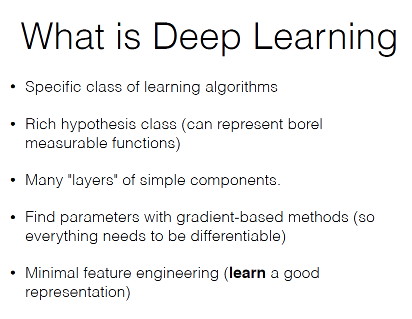

# Deep Learning methods - class notes
## lecture 1 15 Oct 18
There are several types of data in the world. images. tabular. measurements - usually a sequence over time. a signal that evolves with time. Things that are naturally a sequence. Related but not connected to 680. 

To effectively work in the subject you have to know both. Considered an advanced course. Yossi's ML course will make it easier. Now I will cover in 2 lectures something that you should know, if you don't, learn now.

The exercise will be a continuation of the lecture. There will be a TA (hopefully) that can take students questions.

The submission is must, it's not graded. 

The exam examines whether you know the material. the exercises are instructive.

4 programming exercises, similar to last years'. some involve math (not too high)

Machine learning - a plus

If you take the clayton book by me, and skip the language parts, you follow the course pretty well.

Lots of real-world cases are sequences. most courses are in image processing. If image processing is your thing, then this course is still a good promer.

[Graham Neweby course](http://www.phontron.com/class/nn4nlp2018/schedule.html) has about twice as much material (2 lectures a week)

### What is learning
I learn, then I get tested on what I learned. It has to be nontrivial (not just retrieval) but in the same subject matter.

The induction problem: I learned Male/Female (from faces in Israel) and I fail on a test of Chinese students.

### types of learning
- supervised - someone gives me examples (tagged data). From their I need to generalize
   - regression - predict something continuous. from traits of persons, need to predict life expectancy. features of apartments, how much they cost.
   - classificiation - one of a few classes. will this stock price rise or fall. will this person live to be 80? 90? face -> gender, client -> churn, face -> country.
   - structured חיזוי מבני - a few dependent questions. I have an image, draw a rectangle around the elephant. I could pose this as a classification problem. is this pixel part of the elephant? but my answers are dependent on each other. dependency between labels. I [YG] sometimes work on it.

- unsupervised: I get images, without knowing what they are. I need to separate them in a way that will make sense (images of dog in one group, cat in other group). The challenge is to find a metric that creates largest differences between groups and minimum differences within groups.

Everybody wants unsupervised, because it save the hassle of taggin. but it might mislead because the algo might converge to a question i did not intend it to solve.

- unsupervised - I have 1M images, only 1000 of which are labeled. I want to use the entire set to learn. I can say something like "I think these features signify a cat, let's check their frequency in the 1M set". I want to find a way for the 1M to help mee, even though they aren't labeled.

- reinforcement (which we might touch on towards the end of the course).
I don't have knowledge on what to do, but I get rewards. Such as game. a sequence of observations, actions and rewards. I need to understand which of my actions brought me to  agood place. its a desirable way to improve robotics: I want to pick an item, I have lots of control decisions in between, finally I know whether the something was picked up.

If I want to learn to distinguish apples from oranges, I need to represent the object as (numerical) features: weight, hardness, color, circumference,...

Maybe I will fail because I missed some important feature. Deep learning allows me to avoid manual feature engineering.

__Hypothesis class__: i need to decide the scope of my search. e.g. all 2nd degree functions.  Too wide class may hinder generalizaiton. 

__inductive bias__: How the system is biased because of the selection of hypothesis class.

### deep learning

the problems related to sequences:

## learning

### housing data example
Classifying by a linear classifier. if $\hat w \cdot \hat x   + b  >0$ it belongs to one class, if <0, other class

### language classifier
I can take pairs of letters ("bigrams"). Count the instances of each pair so $\{x_i\}$ are the frequency of each pair. I will want weights $w^e_i$, which will score its chances of being English, and $w^g_i$ for German. My classifier will be based on comparing the scores $\sum{x_iw^e_i}$ and $\sum{x_iw^g_i}$

I can get this way, by thinking of $w$ as a matrix, to score each language (and I can score more languages than just these 2)

!class 2 22 Oct

#### Example - synthesize xor
can't do with linear.

### learning as optimization

the label $\mathbf{y}$ is a vector with 1 in the position corresponding to the correct class.

$\mathcal{L}$ will be zero for perfect classification, >0 otherwise. I use an additive loss ("sum over local contributions") to avoid unnecessary calculation complications.

- 0-1 loss
its the "ideal" loss. but its hard to work with, not differentiable. 
- hinge loss:
    - t is the index of the One in the actual
    - p is the index of the maximal prediction, excepting the true class.
    - we expect that to be 0 ideally, anything other will be penalizied

- log-loss (aka cross-entropy loss) 
    - smoother and allows the goal $\mathbf{y}$ to be composed of a "distribution" (more than one nonzero)
    - remark: the signficance (from statistics) is when the y's represent probability vectors.
- softmax: normalizaiton of exponents

> remember the cross-entropy formula

> apply the softmax to a linear scorer results in Logistic regression

#### regularization
why is it not always good? (whiteboard demonstraions of a very high degree function bringing the loss). we need to balance something that works well with something that I can trust as for generalization.

note taht when I train, the "variables" are theta, and x are "constant". the opposite of what happens when predicting.

#### gradient descent
gradient descent - start from an arbitrary point, check the direction of descent, go a step in that direction and so on.

We "don't know why" it works in our case, we have a lot of minima in our functions and still we get good results. it's true that some scheme include starting from several different points before deciding on best minimum.

explanation of the principle of GD. I continue until I converge or I decide it's enough.

This process is slow. I need to calculate loss over all the data. I have 100K or even 1M samples. It's heavy

#### Stochastic GD
we estimate the loss on a sample. This is a very crude approximation of the gradient, but it's very fast. It's faster by [size of data]. It works well even though many steps are not "in the right direction". Some argue the noise is actually helpful.

A variation is minibatch SGD - somewhere in between. Now you need to consider the sample size. In many cases a size-one batch actually works well. note that GPUs and even some CPUs, the computational cost of the batch is the same as a single sample. Theory is lacking, work in progress.

there are other schemes for minimization - check and pick the one that semms to work best

## Lecture 3
### Nonlinear classifier

The problem with the classic sigmoid is that it's easy for the gradient to send us to the rails, but it's hard (small gradient) for the rails to takes us back to the active (linear) area.
$\tanh$ seems similar but usually works better than sigomid.
the hard-tanh is a linearized tanh, it has the 0-gradient issue.

reLU is one of the top two today. even it's almost linear (two linear segments) it expresses the function space well.

ELU is a reLU with a smoothed bend. Still reLU is much more popular.

The Representation Power Theorem, if so why use more than one layer?
- there is a proof that exists, but it doesn't specify it...
- the proof doesn't limit the breadth of the layer, we need more layers to avoid very very wide layers.

#### tuning, complexity, overfitting  (lec.3 14)
in NLP, one hidden layer often gives good results (unlike vision for example).

$\eta_t$ is the learning/stepsize parameter. Play with your learning rate until you see a good convergence of the error.

slide 24: if on the Training Set you can't reach zero, you have a bug, or a very serious problem with learning rate. Or the network is inadequate. But you really want to be aware of the convergence on the Dev Set, it tells you if the generalization is working.

slide 25 if you recognize this type of overfitting, you may want to add regularizations, or go for early stopping, don't add epochs that don't improve.

People today misuse the term regularization. When I  penalize based on a "complexity function", it is truly reg10n. This is the original meaning. Recently in DL, people extended it to mean "every method that avoids overfitting" like dropout, randomization etc.

slide 34 why does the L2 work.

in the exercise you write a MLP from scratch.

---- Oct 29th -------

### dealing with overfitting

In deep learning, there are so many parameters, we are always at risk of overfitting.

- early stopping: using loss or accuracy. they are related, but not quite the same. The reason for separating them is that accuracy is hard to optimize to. 

- regularization: "dont let any one parameter become too big". out of the possibly thousands of parameters, a few get large. they probably describe some specific case. I don't know if that's what's happening, but that's the intuition for this requirement.

#### L1 and L2 regularization
$\R(\Theta)$ 
L2 regularlization "pulls" all parameters towards zero. If the increment in the paramaters helps the loss function, it will be allowed. if not enough, it won't be allowed.

L2 will prefer many small values. L1 doesn't care where to reduce the value.

Are zeros in the matrix a bad thing? no, they're actually good. easier interpretation, maybe less computations to apply.

we can ask both for l1 and l2- it's called "elastic net"

L2 also called "weight decay"

#### Dropout
Calculate the gradient substituting some W's with zero. after calculating the gradient, update the true weights (not the zeros)

\[[i will need to halve the values later because the signal will be too strong - technical point. not critical]]

Intuition - avoid focusing on a single "phenomenon". e.g. if you're learning to classify dogs, maybe your network looks for fur. if you reset these weights, it will have to look for other clues, such as the shape of the ears. 

#### initialization
A good i12n is crucial for a good model. A "perfect" i12n will allow maximum accuracy 

Xavier Glorot: the range of distribution meant to avoid saturation of $\tanh$ elements.

\[[skipped 9 slides to talk on gradient checks]] 
you can check your differentiation by assigning value. 

\[[now going back o the skipped slides]]

#### representations
The scores have more information than just the single tag (the $\arg \max$)

consider the 6 columns of w. each column represents a language. if I look at the columns, I can see which languages are more similar (similar W vectors). 

Each row represents a bigram. 784 rows. similarity between rows indicates similarities between bigrams.

\[[now slides of lec4]]

The markov-4 is a good assumption, it was prevalent for a long time.

I have an assessment of the probability of the entire sequence. now i can choose the more likely sequence.

in translation: after coming up with several possible translations, i will choose the one with the best language model. it's good for any (discrete) sequence. it's a research field of its own.

The training examples are easy to obtain because any sentence in the language will work.

using the one-hot vectors, i can sum them. it will lose the order which is sometimes useful and sometimes not. I can add a decay factor. 

If I chain the individual representations, different-length string will have different-length representations.

W is {size of my vocab x number of neurons}

the 1-hot vector "extracts" from $W$ a row. The first layer's $W$ represents one word in the vocabulary.

With the chaining representation, i have 4 chained $W$s.

slide 37 
what does each $W$ (each layer) mean?
$W3$ is the output layer, W3 says which word we be next, w2 what goes with it. what quadruplets go well with it.

If I want a longer lookback window (5 rather than 4 words) I will increase the size of $W1$ by the size of the representation e.g. 300. it's larger but not too bad. 

if i have the probability of the next word given the history, I can generate sentences. Initial condition? *start* symbols

another nice application is for telling a sequence's genre e.g. economics, world news, sports. I can train a LM per corpus and each sentence compare the score it got on each model

the same model can be used to label the qunituplet. Is this DNA sequence "good" or "bad". Or the tagging - what's the right pos for the middle word.

stopped at #56

-----
12 Nov. 2018
### word embeddings and Word2Vec (lec5.pdf)
The same topic will be covered in 680 from a different angle. Here from the aspect of deep learning and modeling sequences.

Given a prefic, the probability of the next items. Equivalent to What is the probability of this sequence (relative to another)

Embedding layer translates from a symbol, a vocab, to a vector of constant length. each sequence is composed of constant vocabularly. we want symbols appearing in similar contexts to get similar embedding vectors. and we will elaborate. The embedding layer can be transferred to another problem, since this requirement is useful in different applications.

slide 3: we chain the $E$'s (embedding vectors) We chain these vectors and use that as input (a sentence). the final layer will give a probability prediction for each word.

$W^3$ and $softmax$ are expensive because they involve 100,000-row matrices. Maybe i can learn the embedding in a simpler way? 

#### Word2Vec
If we wanted a full language model in Wiki it would run weeks. Word2Vec can run in hours on Wiki
##### Collobert and Weston (preceded W2V)
- instead of predicting the next we will train on predicting the middle word based on surrounding words (e.g. 2 from each side).
In other words, the most relevent 4 words are the _surrounding_ 4 words. Knowing what word follows helps.
This change is very minor in terms of network topology and training technique.
- getting rid of the softmax layer - i don't need probabilities. The loss scoring will be based on ranking.
- The "incorrect" word is sampled by its frequency in the text.

##### W2V
after we understand slide 23 we are left with choosing $s(w,c)$.
the black dog sat on...
- CBOW: 
$(V_{the} + V_{black} + V_{sat} + V_{on})\times V'_{dog}$
- skipgrams

#### Usage of Word2Vec
cosine similarity is useful. for this purpose, normalized vectors are useful. So would be better to normalize upon loading.

slide 34: I can train a POS tagger similarly, using tagged training set. Still, a good embedding is good to expedite this learning process, since words that have close embeddings are more likely to be the same POS. The embeddings brings the power of massive training data in tasks where no large tagged corpi are available.

Depending on the task, we may choose to keep the E's fixed, or allow them to change in the process of training. 

### Gradient based training

