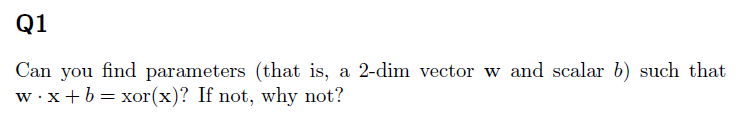

#Exercise 1- responses
Shahar Siegman Oct. 21, 2017

## Q1

This is not possible. this fact can be shown by writing out the inequalities, which lead to a contradiction:

$$
   w= \left( {\begin{array}{cc}
   w_{1} & w_2 \\
   w_3 & w_4 \\
  \end{array} } \right)
$$
$$ w \cdot x =
\left( 
{\begin{array}{c}
w_1 x_1+w_2 x_2\\
w_3 x_1+w_4 x_2
\end{array} }
\right) 
$$
writing out the requirements on $f(x)$:
$$
b \lt 0 \\
w_1 + b \geq 0 \\
w_2 + b \geq 0 \\
w_1 + w_2 + b \lt 0 \Longrightarrow -w_1 - w_2 -b \gt 0
$$

adding the 4th and the the 2nd:
$-w_2 \gt 0 \Longrightarrow w_2 \lt 0 $ 
with $w_2$ and $b_2$ negative, their sum cannot be nonnegative(3rd eq). we arrived at a contradiction. $\square$

## Q2
##### section a

$$
U =  \left( {\begin{array}{cc}
   1 & -2 \\
   -2 & 1 \\
  \end{array} } \right),\\
b2 = \left( 
{\begin{array}{c}
0\\
0
\end{array} }
\right),\\
w= \left( 
{\begin{array}{c}
1\\
1
\end{array} }
\right)\\
$$
$$
x=(0,0)^t \Longrightarrow h=(0,0)^t \Longrightarrow f(x) = 0\\
x=(0,1)^t \Longrightarrow h=(0,1)^t \Longrightarrow f(x) = 1 \\
x=(1,0)^t \Longrightarrow h=(1,0)^t \Longrightarrow f(x) = 1\\
x=(1,1)^t \Longrightarrow h=(0,0)^t \Longrightarrow f(x) = 0\\
$$

