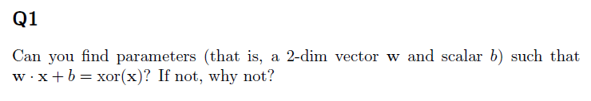
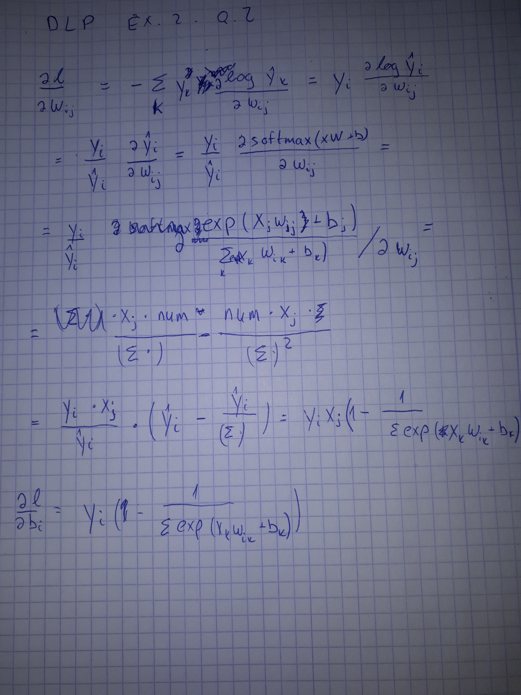

#Exercise 2- responses
Shahar Siegman Oct. 28, 2017

## Q1

$$
\forall x,c:\exp(x+c)=\exp(x)\exp(c)\\
y_i \equiv x_i+c\\
\\
softmax(y)_i = \frac{\exp(y_i)}{\sum_i(\exp(yi))}
=\frac{\exp(c)\exp(x_i)}{\sum_i(\exp(c)\exp(x_i))}\\
=\frac{\exp(c)\exp(x_i)}{\exp(c)\sum_i(\exp(x_i))}
=\frac{\exp(x_i)}{\sum_i(\exp(x_i))}\\
=softmax(x)_i
\square
$$
## Q2
