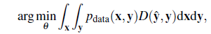
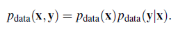
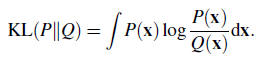
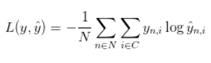
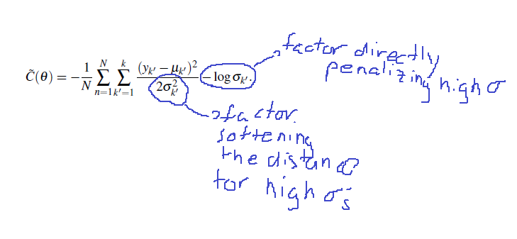
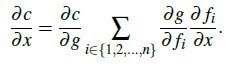
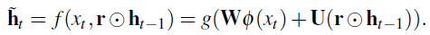

## chapter 2 Function approx as supervised learning
$$\hat y  = f_\theta(\mathbf{x})$$

here $x$ is the input, which is typically a sentence or text (the context is philosophically required but practically dropped).

$\hat y$ is the output we get from our _function_. This is the NN when set with a parameter vector $\mathbf \theta$.

Also, since not all inputs are equally likely, and since outputs are probabilistic, we have $p_{data}$ which is a probability measure over $\mathbf{(x,y)}$ .

Together with the distance function This gives us the expression for optimal $\theta$:

This is the expected risk (expected error) cost function.

The "training set" is just a sample believed to represent the $p_{data}$

The next few paragraphs (up to section 2.3.1 incl.) develop what is essentially the basic methodology of machine learning: 

1. we can use a subset of available training data to decide on the gradient direction in each GD iteration; this is referred to as "stochastic gradient descent" or "minibatch gradient descent". The subset used in each iteration is different (but the exact scheme wasn't specified) 

1. we separate out part of the training set, called validation set, as a way to avoid overfitting: if the gradient descent steps don't improve the score for the validation set, it means we're close enough; trying to get closer will likely move us further from the true minimum.

In 2.4, The test set is introduced by way of saying that since we used the validation set to decide when to stop, we can't use it again to validate the model. We need a 3rd set, the test set, the score on which will represent the score of the model on the entire dataset.

2.5.1 why do we need _features_? answer: they transform the input into a shape which might be more beneficial for predicting $y$

> feature extraction often requires heavy knowledge of the domain in which this function approximation is applied.

and since domain knowledge is hard to come by (or acquire), and when it is acquired it is actually incorrect, manual feature extraction is sometimes futile.

## Chapter 3: Neural Netwroks and backpropagation algorithm

so, As I suspected, the short expresion $p_{data}(x,y)$ hid two distributions: the relative frequency of occurence of x and the probability map of outputs arising from input x.

The discussion so far assumed a single, deterministic output $\mathbf y$. Now we want to construct the cost function of an approximation to a true distribution $p(y|x)$, $\tilde p(y|x)$.

__KL divergence__ is a (non-symmetric) measure for the distance from a true distribution to an approximation: 

, $Q(x)>0$

Note that the predicted probability $Q(x)$ can never be 0. 

Practically,

$$P(x)\log\frac{P(x)}{Q(x)}=
P(x)\log P(x)-P(x)\log Q(x)$$

And since the first term does not depend on the prediction $Q$, we can ignore it in the parameter learning iterations.

In [some sources](http://www.wildml.com/2015/09/implementing-a-neural-network-from-scratch/) the emprical cost function is expressed as

Note that the second summation here is over all classes, or more generally, over the _support_ of y's distribution. For binary classification, $y_{n,i}$ in one of the classes is always 0 and for the other is 1. The support is $k \in \{0,1\}$, and the ___pmf___ is $p^k(1-p)^{1-k}$

#### KL expression for Gaussian distributions  
> [when the distribution is Gaussian] with all sigmas approximated equal, the KL measure reduces to euclidean distance of the approximated means from the true means.

:todo: explore how KL metric actually works, in a notebook or look for a good explanation online.

### 3.2 "automatic" feature extraction

$$\phi_0(\mathbf x) = g(\mathbf W_0 \mathbf x + \mathbf b_0)$$

where: 
- $\mathbf x$ are the original inputrs
- $\mathbf W_0$ is a weight matrix (linear transformtion of the original x's)
- $\mathbf b_0$ is the constant part of the affine transformation
- $g( \cdot )$ is a ___pointwise nonlinearity___.

remember the approximation equation is  $\hat y = f(\phi(x))$, so in addition to the multitude of degrees of freedon in $\phi$'s definition, we also have $f$ (which in the explanations so far was always taken to be computed by linear regression). $f$ is the final layer of the MLP, whose number of outputs corresponds to the number of ouutputs required in the specific problem. So for quantity prediction $f$ can be linear, for probability prediction one often uses the _softmax_ function. 

Here it is also noted that this formulation allows, as the number of dimensions is increased, to represent any shape of estimation function from x to y. This has been known since the 60's (the _extreme learning machine_). The problem has always been finding an effective training technique. [[What about generalizability??]]

>> "the full cost function is almost always the unweighted sum of [the] per sample cost functions"

:todo: graph the cost function in equation 3.14

## 3.3 The multilayer perceptron (MLP)

The multi layer perceptron is an efficient system to automatically create an arbitrary, possibly large number of features from the input, and then combine those features into an output which represents the desired answer, usually the mean (and possibliy additional parameters) of the result to the question.

The MLP has two primary requirements:

1. with calibrated parameters, provide a well defined (and easy to calculate) output probability for each input x

1. provide a method to tune those parameters given a training set

each "layer" performs an affine transformation of the 
input, and then applies a point-wise nonlinearity; this is the input to the next layer; Thus "features of features of features" are calculated recursively.

Since gradient descent requires evaluating the gradient at the current point, the fact that the nonlinearity is an exponential function (e.g. the logistic function $\frac{1}{1+\exp ^{-x}}$ or $\tanh$) is useful as its derivative has a simple form when expressed in terms of the (underived) original function.

The intuitive explanation for the usefulness of this machinery is that the full transformation (from the input to the output layer) can be made (using the right parameters) to approximate any nonlinear function. With increasing dimensionality, this approximation can be refined as much as desired. [[this does not touch another question, possibly just as important: with such great flexibility in the functional form, how do we design the MLP to capture the general form correctly rather than overfit the training data? should automated feature extraction be applied with complete disregard to domain knowledge?]]. The _backpropagation_ algorithm provides the computationally-efficient method of learning the full parameter set in one algorithmic scheme, by applying the chain rule to the derivatives of the next layer in order to evaluate the derivatives of the previous one.

There are several engineering choices to be made:
1. the type of nonlinearity (usually, but not always, pointwise)
1. the output layer functional form (independent of the hidden layers' functional form)
1. the number of layers and the number of nodes in each layer
1. The "aggregation" function in the output layer.
1. regularization (not mentioned or discussed in cho's this section of the lecture)
1. GD/SGD/minibatch
1. step size heuristic

The choice of all these different parameters is "heavily task-, data- and model-dependent" [[so we haven't really gotten away without applying domain-specific knowledge, have we?]]

The example calculates the derivatives analytically in the case of a single layer; the systematics of the general case are then explained, as the reader understands what steps will need to be repeated in the derivation process when the MLP contains more than one hidden layer.

## 4 Recurrent Neural Networks and Gater Recurrent units

### Variable length input
> A variable length input x is a sequence where each input $x$ has a different number of elements

$$x^n=x^n_1,x^n_2,\ldots,x^n_{l^n}$$

### The memory vector
The memory vector is a state vector of the computation. it is analogous to a layer in the simpler MLP. 

### description of the calculation
The calculation is achieved by applying the __same__ transformation to each layer (no layer-specific transformation matrices) but with new "bloated input" each time. by "bloated input" I mean a [[constant-length?]] vector that is the result of applying a transformation in the input (again, we will use the same parameters with each input)

The chain rule easily generlizes, too. While the same "node" (quantity, or variable) is used in several calculations, the chain rule states that the partial derivative is simply the sum of the partial derivatives of each of the functions with the same variable:

 

> This means that when multiple derivatives are _backpropagated_ into a single node, the node should first sum them and multiply its summed derivative with its own derivative.

### 4.1.3 sentiment analysis
for this example, $\mathbf{x_t}$ is a one-hot constant-length vector. the RNN will process each word by itself.

we don't apply any "input transformation", so $\phi(x_t)=x_t$.

### 4.1.4 Variable length output

This is essentially the same, with applying an output layer after each input $x_t$ is evaluated.

But this raises the need to use the output as an input to the next calcluation, in order to take advantage of the fact that certain output sequences are less likely (such as noun-noun-noun).

This raises the issue, given that each calculation step results in output _probabilities_ for each class - of which of the classes to use as input in the next step. When we train, we use the single class that was in the label. A straightforward, but suboptimal answer is to always take the class that was most likely in the previous round. Another possible answer is to try a few combinations for the last few output [[this wasn't detailed]]

[[in page 31, "one can simply evaluate $\log p(y|x)$ for every possible output sequence and choose the one with the highest conditional probability" is is unclear what the author means by "highest conditional probability"]]

### 4.2.2 gated recurrent units

Here the set of learning parameters is extended in order to introduce a "read gate" and a "write gate", which can be interpreted as "focus in reading" and "stepsize in writing", respectively.
So the recursive update formula was introduced as (4.5)

$$\mathbf h_t=f(x_t,\mathbf h_{t-1})$$

Then extended to include the previous output:

$$\mathbf h_t=f(x_t,y_{t-1},\mathbf h_{t-1})$$

and now the gates are added

