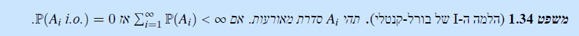
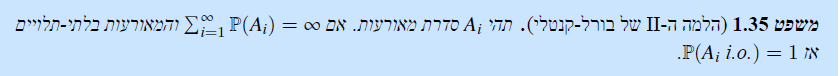

---- Oct 22 -----
### definitions
### _infinitely often_ and _almost everywhere_
- from $A_n$ to $A_n\ i.o.$: $\bigcap\bigcup_{k=m} ^\infty A_k$
- from $A_n$ to $A_n\ a.e.$: $\bigcup\bigcap_{k=m} ^\infty A_k$
### Fatou's Lemma
$$
\mathbb{P}(\{A_n\ a.e\}) \leq \lim \inf \mathbb{P}(A_n)\\
\mathbb{P}(\{A_n\ i.o\}) \geq \lim \sup \mathbb{P}(A_n)\\
$$
The proof uses continuity replaces $\inf\mathbb{P}(A_k)$ with $\mathbb{P}(\bigcap A_k)$ stating that the former is $\geq$ than the latter, due to "containment".

### Borel-Cantelli
#### BC1

in other words
$$\mathbb{P}(\{A_n\ i.o\}) \gt 0 \Longrightarrow \sum\mathbb{P}(A_n) \rightarrow\infty
$$
When we know the $i.o$ events are non-negligibble, they will blow up the series' sum.

#### BC2

when we have a series of events with non-converging sum of probabilities, then either they maybe they are dependent (i.e. there are duplications). if they are independent, i.e. there are no duplications, then the $i.o.$ events are the only non-negligible events.

This is harder to see intuitively. It signifies that if $A_i$ keeps "producing" more and more events that are not duplications of earlier events in the series, then "there's no room" for events that are not in the $i.o.$. If it imposes a limitation on the outcome of previous tosses, then it's not independent; if it doesn't, then all outcomes will be represented somewhere in the union that defines the $i.o.$.

