# הסתברות - מבוא 
## 1. יסודות מרחב מדגם בדיד

- $\Omega$: The group of _outcomes_ (i.e. an entire configuration).
- $\mathcal{F}$: $2^\Omega$, the group of _events_ מאורעות

##### atomic probability function for countable $\Omega$

$$
    p: \Omega \rightarrow [0,1],\\
    \sum_{\omega \in \Omega} p(\omega)=1
$$

#### Definition of a probability function
A function $\mathbb{P}$ is a probability function iff:
- it is defined over $\mathcal{F}$ and maps to [0,1]: 
 $\mathbb{P}: \mathcal{F} \rightarrow [0,1]$ 
- $ \mathbb{P}(\Omega)=1$
- $ \mathbb{P}(\dot{\bigcup} A_i) = \sum_{i \in \mathbb{N}}\mathbb{P}(A_i)
$

The following function is a probability function, and it is the only one for which $\forall \omega, \mathbb{P}(\{\omega\}) = p(\omega)$:

$$\mathbb{P}(A \in \mathcal{F}) \equiv \sum_{\omega \in A}p(\omega)$$

> $(\Omega,\mathcal{F},\mathbb{P})$ is a countable probability space

#### properties of a probability function
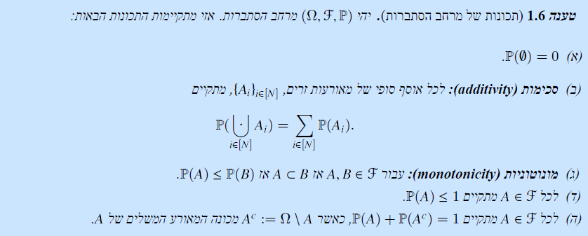

#### uniform probability space
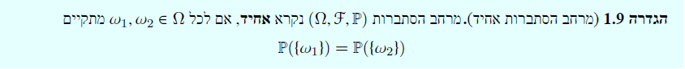

#### Boole's inequality (upper bound for nondisjoin union)
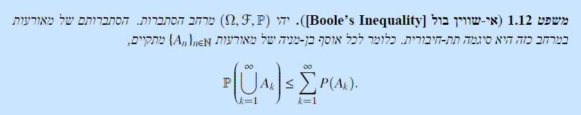

#### monotonous sets and continuity of $\mathbb{P}$
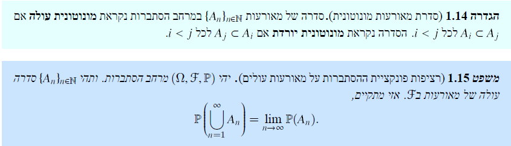

### inclusion-exclusion principle

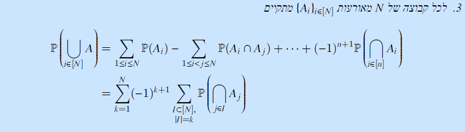

## 2. הסתברות מותנה ואי תלות
$\mathbb{P}'$ is a new probability function over $\Omega$. In the simple two-dice problem, The elements of $\Omega$ which are no longer possible have probability 0, and from consideration of normalization and symmetry of elements in $S$, we determine $\mathbb{P}'$.

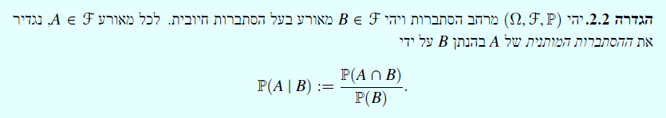

> The definition above results in a valid probability function

For A, B, D events with positive probability:
- redundancy of superset: 
$A \subset B \implies \mathbb{P}(D|A) = \mathbb{P}(D|A,B)$
- chain rule:
$\mathbb{P}(A \cap B) = \mathbb{P}(B) \cdot \mathbb{P}(A|B)$
- multicondition: 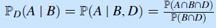

#### חלוקה
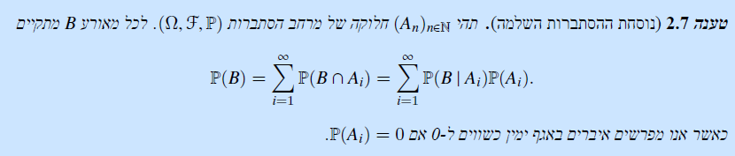

a few "paradoxes":
- at least one child is a boy, what is the chance of both children boys?

- Bayes' formula
- polya's urn

#### independence

#### product of probability spaces
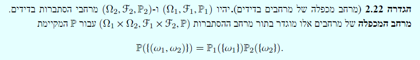

## משתנה מקרי
### משתנה מקרי בדיד
#### [atomic] probability mass function
$$p_X(s)= \sum_{X(\omega)=s}\mathbb{P}(\{\omega\})$$

__support__ of $X$: $Supp(X)={\{x \in \mathbb{R}: p_X>0\}}$

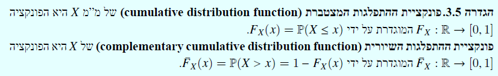

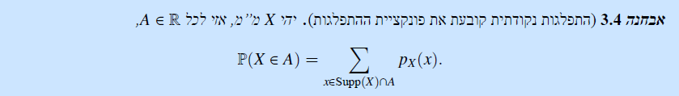

# הסתברות 2
# אלגברה ו$\sigma$ אלגברה

### introduction

- a $\sigma$-algebra can be generated from a subset by taking all countable unions of the set and their complements.

- Other examples:
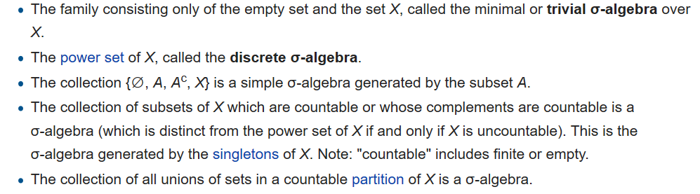

- a $\sigma$ algebra can be reduced from $\Omega$ to $\Omega' \subseteq \Omega$ by intersecting each of its members of $\Omega'$

- for measurable space $\{(\Omega_n,\mathcal{F}_n)\}$, the "Direct sum" 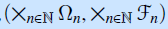 is a measurable space.

\[[what does this signify?]] 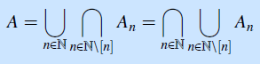

#### premeasure
\[[how is premeasure different?]]

